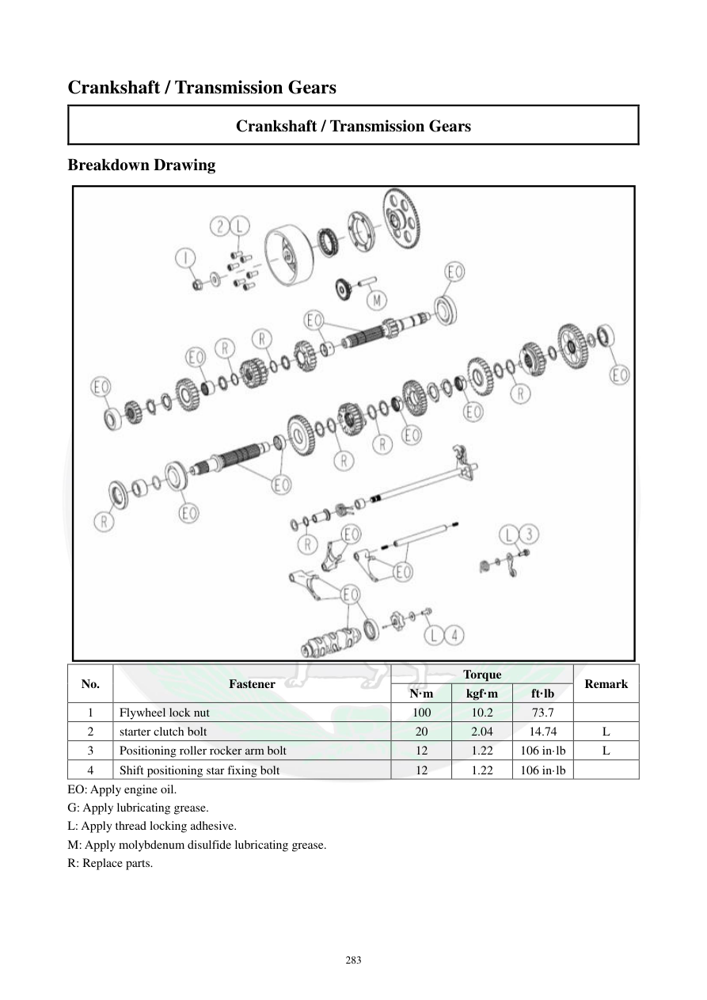

# Manual page 284

> Source: [page-0284.md](../source/page-0284.md)

## Page image / diagram

- [page-0284-img-01.jpeg](../images/embedded/page-0284-img-01.jpeg)

## Extracted text

# Source page 284

 
283 
Crankshaft / Transmission Gears 
Crankshaft / Transmission Gears 
Breakdown Drawing 
 
No. 
Fastener 
Torque 
Remark 
N·m 
kgf·m 
ft·lb 
1 
Flywheel lock nut 
100 
10.2 
73.7 
 
2 
starter clutch bolt 
20 
2.04 
14.74 
L 
3 
Positioning roller rocker arm bolt 
12 
1.22 
106 in·lb 
L 
4 
Shift positioning star fixing bolt 
12 
1.22 
106 in·lb 
 
EO: Apply engine oil. 
G: Apply lubricating grease. 
L: Apply thread locking adhesive. 
M: Apply molybdenum disulfide lubricating grease. 
R: Replace parts.

## Persian notes

<!-- Persian translation/explanation will be added here. -->
