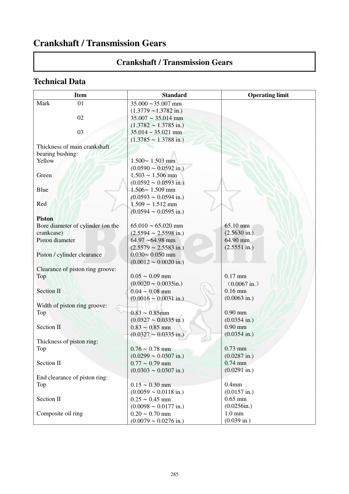

# Manual page 286

> Source: [page-0286.md](../source/page-0286.md)

## Page image / diagram

## Extracted text

# Source page 286

 
285 
Crankshaft / Transmission Gears 
Crankshaft / Transmission Gears 
Technical Data 
Item 
Standard 
Operating limit 
Mark         01 
35.000 ∼35.007 mm 
(1.3779 ∼1.3782 in.) 
 
02 
 
03 
35.007 ∼ 35.014 mm 
(1.3782 ∼ 1.3785 in.) 
35.014 ~ 35.021 mm 
(1.3785 ∼ 1.3788 in.) 
 
Thickness of main crankshaft 
bearing bushing: 
 
 
Yellow 
1.500∼ 1.503 mm 
(0.0590 ∼ 0.0592 in.) 
 
Green 
1.503 ∼ 1.506 mm 
(0.0592 ∼ 0.0593 in.) 
 
Blue 
 
Red 
1.506∼ 1.509 mm 
(0.0593 ∼ 0.0594 in.) 
1.509 ∼ 1.512 mm 
(0.0594 ∼ 0.0595 in.) 
 
Piston 
 
 
Bore diameter of cylinder (on the 
crankcase) 
65.010 ∼ 65.020 mm 
(2.5594 ∼ 2.5598 in.) 
65.10 mm 
(2.5630 in.) 
Piston diameter 
64.97 ∼64.98 mm 
(2.5579 ∼ 2.5583 in.) 
64.90 mm 
(2.5551 in.) 
Piston / cylinder clearance 
0.030∼ 0.050 mm 
(0.0012 ∼ 0.0020 in.) 
 
Clearance of piston ring groove: 
 
 
Top 
0.05 ∼ 0.09 mm 
(0.0020 ∼ 0.0035in.) 
0.17 mm 
（0.0067 in.） 
Section II 
0.04 ∼ 0.08 mm 
(0.0016 ∼ 0.0031 in.) 
0.16 mm 
(0.0063 in.) 
Width of piston ring groove: 
 
 
Top  
0.83 ∼ 0.85mm 
(0.0327 ∼ 0.0335 in.) 
0.90 mm 
(0.0354 in.) 
Section II 
0.83 ∼ 0.85 mm 
(0.0327 ∼ 0.0335 in.) 
0.90 mm 
(0.0354 in.) 
Thickness of piston ring: 
 
 
Top 
0.76 ∼ 0.78 mm 
(0.0299 ∼ 0.0307 in.) 
0.73 mm 
(0.0287 in.) 
Section II 
0.77 ∼ 0.79 mm 
(0.0303 ∼ 0.0307 in.) 
0.74 mm 
(0.0291 in.) 
End clearance of piston ring: 
 
 
Top 
0.15 ∼ 0.30 mm 
(0.0059 ∼ 0.0118 in.) 
0.4mm 
(0.0157 in.) 
Section II 
0.25 ∼ 0.45 mm 
(0.0098 ∼ 0.0177 in.) 
0.65 mm 
(0.0256in.) 
Composite oil ring 
0.20 ∼ 0.70 mm 
(0.0079 ∼ 0.0276 in.) 
1.0 mm 
(0.039 in.)

## Persian notes

### مشخصات فنی پیستون و بوش یاتاقان اصلی
- بوش یاتاقان اصلی بر اساس علامت سوراخ دارای سه محدوده است: **01 = 35.000–35.007 mm، 02 = 35.007–35.014 mm، 03 = 35.014–35.021 mm**.
- ضخامت بوش اصلی: زرد **1.500–1.503 mm**، سبز **1.503–1.506 mm**، آبی **1.506–1.509 mm**، قرمز **1.509–1.512 mm**.
- قطر سیلندر: **65.010–65.020 mm**؛ حد **65.10 mm**.
- قطر پیستون: **64.97–64.98 mm**؛ حد **64.90 mm**.
- لقی پیستون/سیلندر: **0.030–0.050 mm**.
- لقی شیار رینگ: رینگ بالایی **0.05–0.09 mm**، حد **0.17 mm**؛ رینگ دوم **0.04–0.08 mm**، حد **0.16 mm**.
- عرض شیار رینگ‌های بالایی و دوم: **0.83–0.85 mm**؛ حد **0.90 mm**.
- ضخامت رینگ بالایی: **0.76–0.78 mm**؛ حد **0.73 mm**. رینگ دوم: **0.77–0.79 mm**؛ حد **0.74 mm**.
- دهانه رینگ بالایی: **0.15–0.30 mm**؛ حد **0.40 mm**. رینگ دوم: **0.25–0.45 mm**؛ حد **0.65 mm**. رینگ روغنی کامپوزیتی: **0.20–0.70 mm**؛ حد **1.0 mm**.
- اعداد انتخاب بوش و رنگ‌ها باید با تصویر جدول صفحه کنترل شوند، چون OCR جدول ممکن است فاصله/ستون‌ها را به‌هم ریخته باشد.
