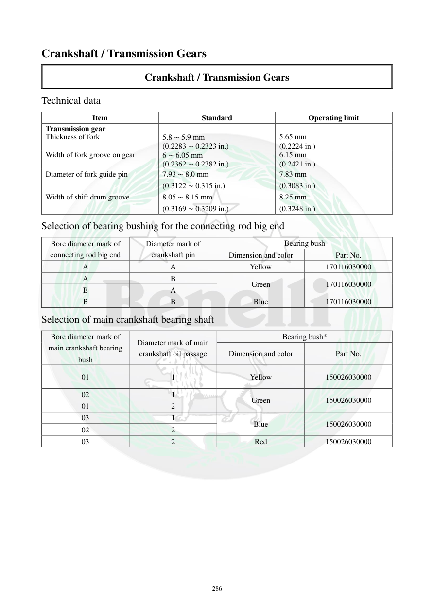

# Manual page 287

> Source: [page-0287.md](../source/page-0287.md)

## Page image / diagram

## Extracted text

# Source page 287

 
286 
Crankshaft / Transmission Gears 
Crankshaft / Transmission Gears 
Technical data 
Item 
Standard 
Operating limit 
Transmission gear 
 
 
Thickness of fork 
5.8 ∼ 5.9 mm 
(0.2283 ∼ 0.2323 in.) 
5.65 mm 
(0.2224 in.) 
Width of fork groove on gear 
6 ∼ 6.05 mm 
(0.2362 ∼ 0.2382 in.) 
6.15 mm 
(0.2421 in.) 
Diameter of fork guide pin 
7.93 ∼ 8.0 mm 
(0.3122 ∼ 0.315 in.) 
7.83 mm 
(0.3083 in.) 
Width of shift drum groove 
8.05 ∼ 8.15 mm 
(0.3169 ∼ 0.3209 in.) 
8.25 mm 
(0.3248 in.) 
Selection of bearing bushing for the connecting rod big end 
Bore diameter mark of 
connecting rod big end  
Diameter mark of 
crankshaft pin 
Bearing bush 
Dimension and color 
Part No. 
A 
A 
Yellow 
170116030000 
A 
B 
Green 
170116030000 
B 
A 
B 
B 
Blue 
170116030000 
Selection of main crankshaft bearing shaft 
Bore diameter mark of 
main crankshaft bearing 
bush 
Diameter mark of main 
crankshaft oil passage 
Bearing bush* 
Dimension and color 
Part No. 
01 
1 
Yellow 
150026030000 
02 
1 
Green 
150026030000 
01 
2 
03 
1 
Blue 
150026030000 
02 
2 
03 
2 
Red 
150026030000

## Persian notes

<!-- Persian translation/explanation will be added here. -->
