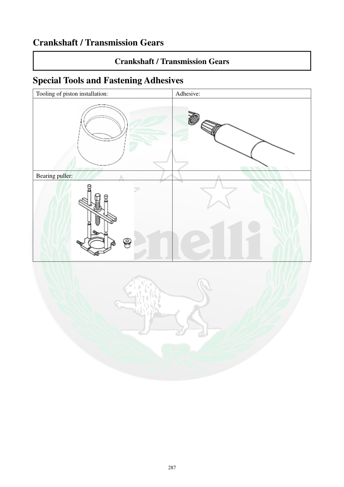

# Manual page 288

> Source: [page-0288.md](../source/page-0288.md)

## Page image / diagram

- [page-0288-img-01.png](../images/embedded/page-0288-img-01.png)

- [page-0288-img-02.png](../images/embedded/page-0288-img-02.png)

- [page-0288-img-03.png](../images/embedded/page-0288-img-03.png)

## Extracted text

# Source page 288

 
287 
Crankshaft / Transmission Gears 
Crankshaft / Transmission Gears 
Special Tools and Fastening Adhesives 
Tooling of piston installation: 
Adhesive: 
 
 
Bearing puller:

## Persian notes

<!-- Persian translation/explanation will be added here. -->
