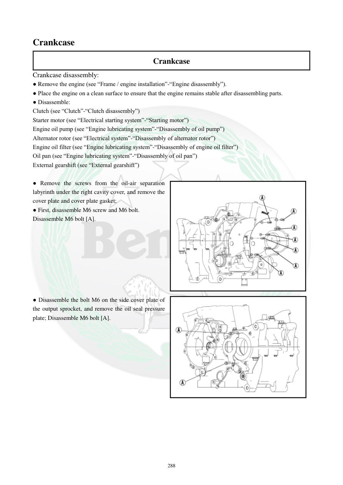

# Manual page 289

> Source: [page-0289.md](../source/page-0289.md)

## Page image / diagram

- [page-0289-img-01.png](../images/embedded/page-0289-img-01.png)

- [page-0289-img-02.png](../images/embedded/page-0289-img-02.png)

## Extracted text

# Source page 289

 
288 
Crankcase 
Crankcase 
Crankcase disassembly: 
● Remove the engine (see “Frame / engine installation”-“Engine disassembly”). 
● Place the engine on a clean surface to ensure that the engine remains stable after disassembling parts. 
● Disassemble: 
Clutch (see “Clutch”-“Clutch disassembly”) 
Starter motor (see “Electrical starting system”-“Starting motor”) 
Engine oil pump (see “Engine lubricating system”-“Disassembly of oil pump”) 
Alternator rotor (see “Electrical system”-“Disassembly of alternator rotor”) 
Engine oil filter (see “Engine lubricating system”-“Disassembly of engine oil filter”) 
Oil pan (see “Engine lubricating system”-“Disassembly of oil pan”) 
External gearshift (see “External gearshift”) 
 
● Remove the screws from the oil-air separation 
labyrinth under the right cavity cover, and remove the 
cover plate and cover plate gasket; 
● First, disassemble M6 screw and M6 bolt. 
Disassemble M6 bolt [A]. 
 
 
 
 
 
 
 
 
● Disassemble the bolt M6 on the side cover plate of 
the output sprocket, and remove the oil seal pressure 
plate; Disassemble M6 bolt [A].

## Persian notes

### بازکردن پوسته موتور، بخش اول
- موتور را از شاسی خارج کرده و روی سطح تمیز و پایدار قرار دهید.
- ابتدا مجموعه‌هایی که مانع بازشدن پوسته هستند، طبق بخش‌های مربوط باز شوند: کلاچ، استارت، پمپ روغن، روتور آلترناتور، فیلتر روغن، کارتل و مکانیزم تعویض دنده خارجی.
- پیچ‌های مجموعه جداکننده روغن/هوا در حفره سمت راست را باز کرده و صفحه پوشش و واشر آن را خارج کنید.
- ابتدا پیچ/بولت **M6** و سپس بولت **M6 [A]** طبق شکل باز شود.
- پیچ M6 صفحه جانبی کاور چرخ‌دنده خروجی را باز کرده و صفحه نگهدارنده کاسه‌نمد را خارج کنید.
- ترتیب و محل دقیق پیچ‌ها را با تصویر صفحه تطبیق دهید.
