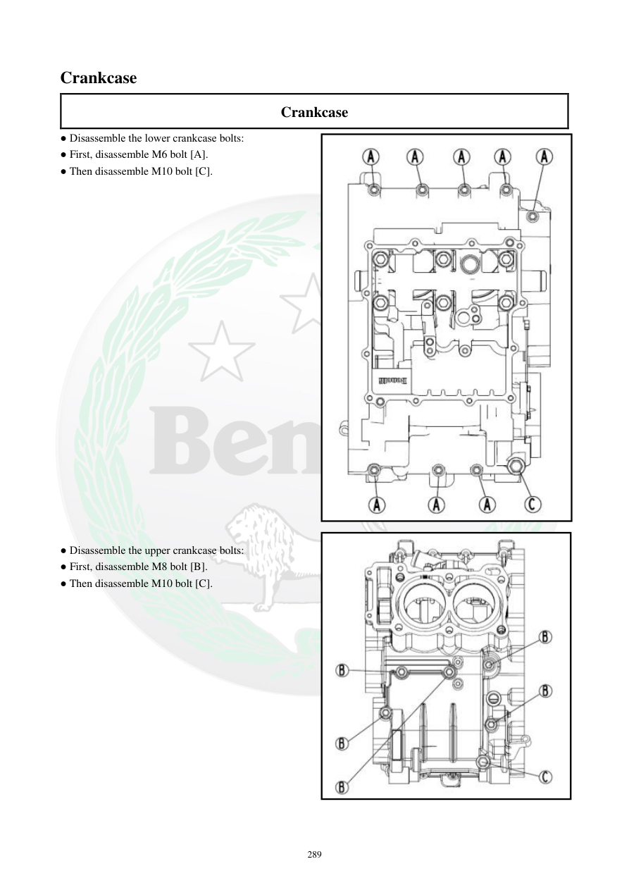

# Manual page 290

> Source: [page-0290.md](../source/page-0290.md)

## Page image / diagram

- [page-0290-img-01.jpeg](../images/embedded/page-0290-img-01.jpeg)

- [page-0290-img-02.jpeg](../images/embedded/page-0290-img-02.jpeg)

## Extracted text

# Source page 290

 
289 
Crankcase 
Crankcase 
● Disassemble the lower crankcase bolts: 
● First, disassemble M6 bolt [A]. 
● Then disassemble M10 bolt [C]. 
 
 
 
 
 
 
 
 
 
 
 
 
 
 
 
 
 
 
 
 
 
 
● Disassemble the upper crankcase bolts: 
● First, disassemble M8 bolt [B]. 
● Then disassemble M10 bolt [C].

## Persian notes

### بازکردن پیچ‌های پوسته موتور
- برای نیمه پایینی پوسته: ابتدا بولت **M6 [A]** و سپس بولت **M10 [C]** باز شود.
- برای نیمه بالایی پوسته: ابتدا بولت **M8 [B]** و سپس بولت **M10 [C]** باز شود.
- ترتیب بازکردن پیچ‌ها مهم است و باید مطابق شکل صفحه انجام شود.
