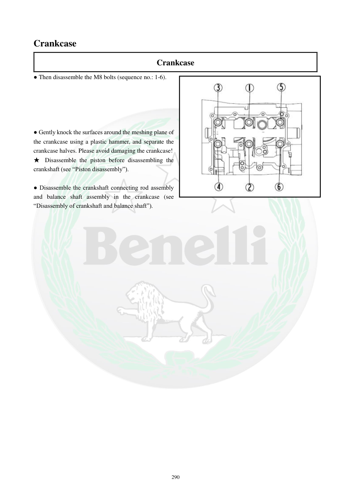

# Manual page 291

> Source: [page-0291.md](../source/page-0291.md)

## Page image / diagram

- [page-0291-img-01.jpeg](../images/embedded/page-0291-img-01.jpeg)

## Extracted text

# Source page 291

 
290 
Crankcase 
Crankcase 
● Then disassemble the M8 bolts (sequence no.: 1-6). 
 
 
 
 
 
● Gently knock the surfaces around the meshing plane of 
the crankcase using a plastic hammer, and separate the 
crankcase halves. Please avoid damaging the crankcase! 
★ Disassemble the piston before disassembling the 
crankshaft (see “Piston disassembly”). 
 
● Disassemble the crankshaft connecting rod assembly 
and balance shaft assembly in the crankcase (see 
“Disassembly of crankshaft and balance shaft”).

## Persian notes

<!-- Persian translation/explanation will be added here. -->
