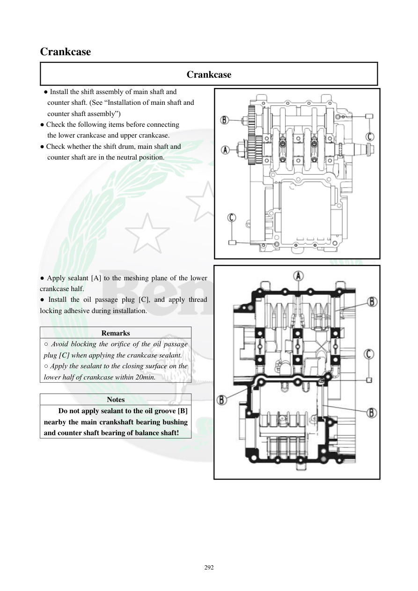

# Manual page 293

> Source: [page-0293.md](../source/page-0293.md)

## Page image / diagram

- [page-0293-img-01.png](../images/embedded/page-0293-img-01.png)

- [page-0293-img-02.jpeg](../images/embedded/page-0293-img-02.jpeg)

## Extracted text

# Source page 293

 
292 
Crankcase 
Crankcase 
 ● Install the shift assembly of main shaft and  
counter shaft. (See “Installation of main shaft and  
counter shaft assembly”) 
● Check the following items before connecting  
  the lower crankcase and upper crankcase. 
● Check whether the shift drum, main shaft and  
counter shaft are in the neutral position. 
 
 
 
 
 
 
 
 
 
 
● Apply sealant [A] to the meshing plane of the lower 
crankcase half. 
● Install the oil passage plug [C], and apply thread 
locking adhesive during installation. 
 
Remarks 
○ Avoid blocking the orifice of the oil passage 
plug [C] when applying the crankcase sealant. 
○ Apply the sealant to the closing surface on the 
lower half of crankcase within 20min. 
 
Notes 
Do not apply sealant to the oil groove [B] 
nearby the main crankshaft bearing bushing 
and counter shaft bearing of balance shaft!

## Persian notes

<!-- Persian translation/explanation will be added here. -->
