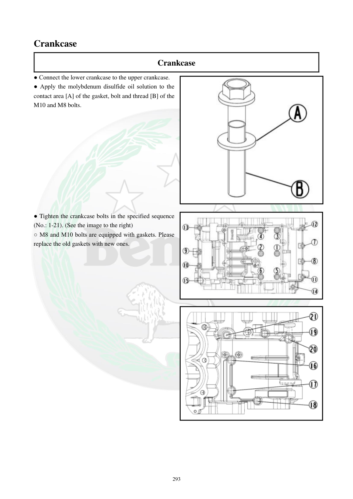

# Manual page 294

> Source: [page-0294.md](../source/page-0294.md)

## Page image / diagram

- [page-0294-img-01.png](../images/embedded/page-0294-img-01.png)

- [page-0294-img-02.jpeg](../images/embedded/page-0294-img-02.jpeg)

- [page-0294-img-03.jpeg](../images/embedded/page-0294-img-03.jpeg)

## Extracted text

# Source page 294

 
293 
Crankcase 
Crankcase 
● Connect the lower crankcase to the upper crankcase. 
● Apply the molybdenum disulfide oil solution to the 
contact area [A] of the gasket, bolt and thread [B] of the 
M10 and M8 bolts. 
 
 
 
 
 
 
 
 
 
 
 
● Tighten the crankcase bolts in the specified sequence 
(No.: 1-21). (See the image to the right) 
○ M8 and M10 bolts are equipped with gaskets. Please 
replace the old gaskets with new ones.

## Persian notes

### بستن نیمه‌های پوسته موتور
- نیمه پایینی و بالایی پوسته را به هم متصل کنید.
- روی نواحی تماس مشخص‌شده **محلول روغن + مولیبدن دی‌سولفید** اعمال شود.
- این ماده طبق جدول دفترچه برای ناحیه تماس **واشر، پیچ و رزوه پیچ‌های M10 و M8** استفاده می‌شود.
- پیچ‌های پوسته باید دقیقاً طبق ترتیب مشخص‌شده **1 تا 21** سفت شوند.
- واشرهای همراه پیچ‌های **M8 و M10** باید با **واشر نو** جایگزین شوند.
