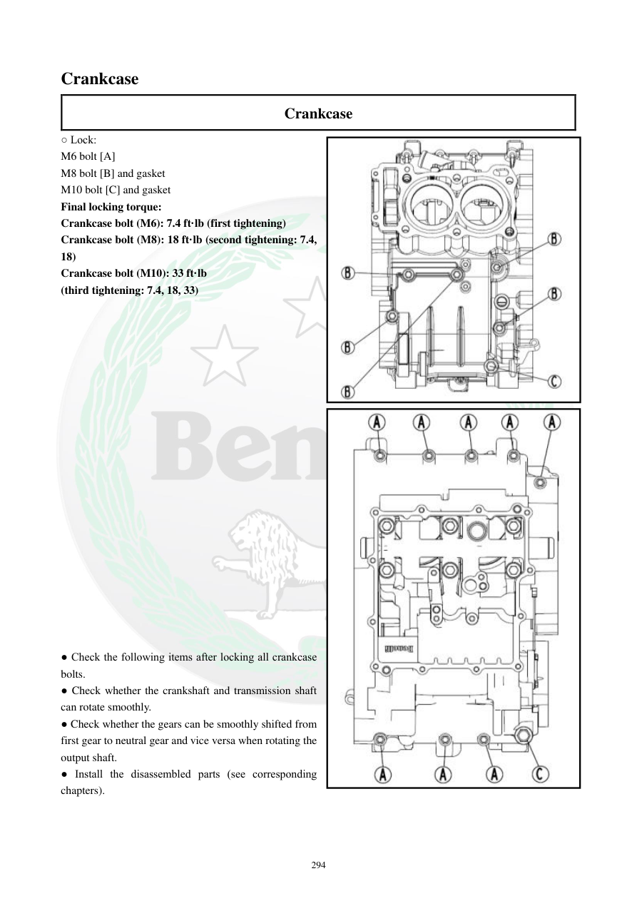

# Manual page 295

> Source: [page-0295.md](../source/page-0295.md)

## Page image / diagram

- [page-0295-img-01.jpeg](../images/embedded/page-0295-img-01.jpeg)

- [page-0295-img-02.jpeg](../images/embedded/page-0295-img-02.jpeg)

## Extracted text

# Source page 295

 
294 
Crankcase 
Crankcase 
○ Lock: 
M6 bolt [A] 
M8 bolt [B] and gasket 
M10 bolt [C] and gasket 
Final locking torque: 
Crankcase bolt (M6): 7.4 ft·lb (first tightening) 
Crankcase bolt (M8): 18 ft·lb (second tightening: 7.4, 
18) 
Crankcase bolt (M10): 33 ft·lb  
(third tightening: 7.4, 18, 33) 
 
 
 
 
 
 
 
 
 
 
 
 
 
 
 
 
 
 
 
 
 
● Check the following items after locking all crankcase 
bolts. 
● Check whether the crankshaft and transmission shaft 
can rotate smoothly. 
● Check whether the gears can be smoothly shifted from 
first gear to neutral gear and vice versa when rotating the 
output shaft. 
● Install the disassembled parts (see corresponding 
chapters).

## Persian notes

### گشتاور نهایی پوسته موتور و کنترل پس از مونتاژ
- پیچ پوسته **M6**: گشتاور نهایی **7.4 ft·lb**.
- پیچ پوسته **M8**: گشتاور نهایی **18 ft·lb**؛ مرحله اول **7.4** و مرحله دوم **18 ft·lb**.
- پیچ پوسته **M10**: گشتاور نهایی **33 ft·lb**؛ مراحل **7.4 → 18 → 33 ft·lb**.
- بعد از سفت‌کردن همه پیچ‌ها، میل‌لنگ و شفت انتقال را بچرخانید و از چرخش روان آنها مطمئن شوید.
- با چرخاندن شفت خروجی، تعویض دنده بین **دنده یک و خلاص** را کنترل کنید.
- سپس تمام قطعات بازشده طبق فصل‌های مربوط دوباره نصب شوند.
