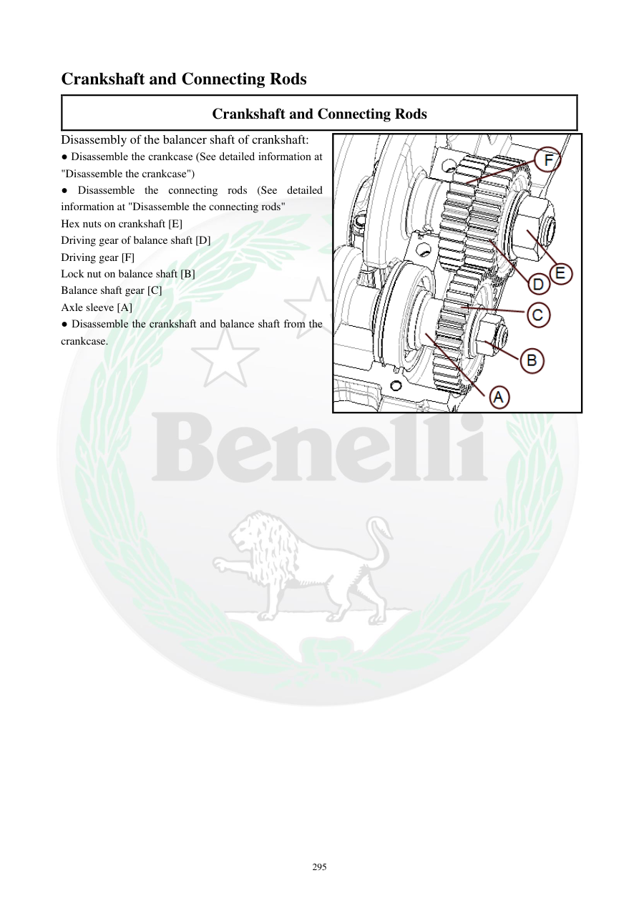

# Manual page 296

> Source: [page-0296.md](../source/page-0296.md)

## Page image / diagram

- [page-0296-img-01.png](../images/embedded/page-0296-img-01.png)

## Extracted text

# Source page 296

 
295 
Crankshaft and Connecting Rods  
Crankshaft and Connecting Rods 
Disassembly of the balancer shaft of crankshaft: 
● Disassemble the crankcase (See detailed information at 
"Disassemble the crankcase") 
● Disassemble the connecting rods (See detailed 
information at "Disassemble the connecting rods"  
Hex nuts on crankshaft [E] 
Driving gear of balance shaft [D] 
Driving gear [F] 
Lock nut on balance shaft [B] 
Balance shaft gear [C] 
Axle sleeve [A] 
● Disassemble the crankshaft and balance shaft from the 
crankcase.

## Persian notes

### بازکردن میل‌لنگ و شفت بالانسر
- ابتدا پوسته موتور و سپس شاتون‌ها طبق بخش‌های مربوط باز شوند.
- قطعات مشخص‌شده در شکل شامل مهره‌های شش‌گوش میل‌لنگ **[E]**، چرخ‌دنده محرک بالانسر **[D]**، چرخ‌دنده محرک **[F]**، مهره قفل بالانسر **[B]**، چرخ‌دنده بالانسر **[C]** و غلاف محور **[A]** هستند.
- پس از جدا کردن این اجزا، مجموعه میل‌لنگ و بالانسر از پوسته خارج می‌شود.
- برای ترتیب دقیق قطعات، تصویر صفحه مرجع است.
