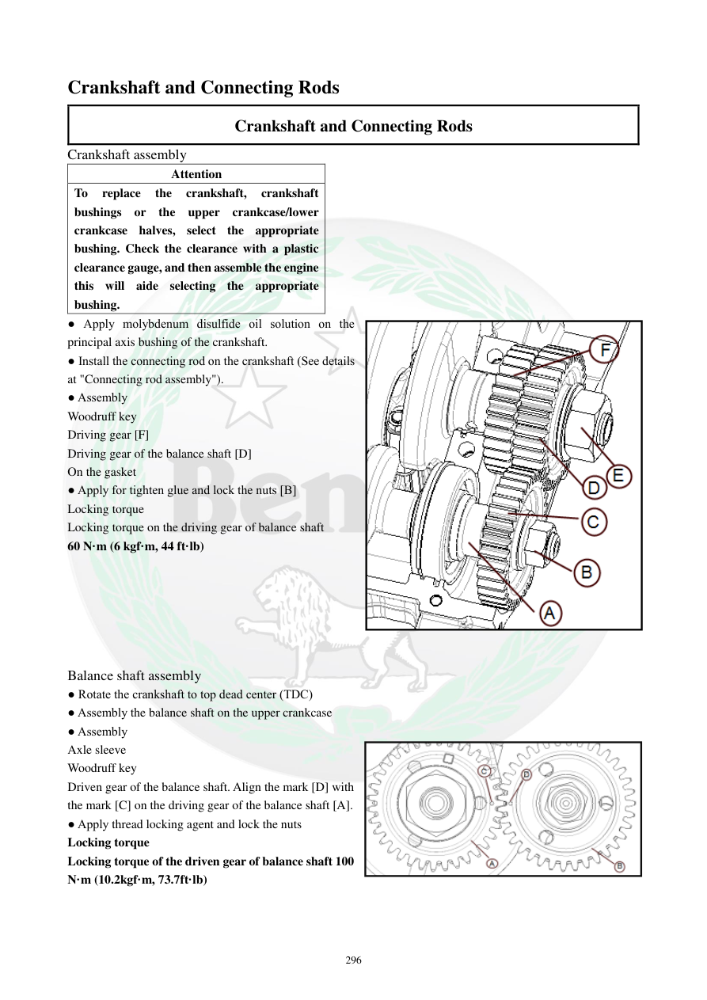

# Manual page 297

> Source: [page-0297.md](../source/page-0297.md)

## Page image / diagram

- [page-0297-img-02.png](../images/embedded/page-0297-img-02.png)

## Extracted text

# Source page 297

 
296 
Crankshaft and Connecting Rods 
Crankshaft and Connecting Rods 
Crankshaft assembly 
Attention 
To 
replace 
the 
crankshaft, 
crankshaft 
bushings or the upper crankcase/lower 
crankcase halves, select the appropriate 
bushing. Check the clearance with a plastic 
clearance gauge, and then assemble the engine 
this will aide selecting the appropriate 
bushing.  
● Apply molybdenum disulfide oil solution on the 
principal axis bushing of the crankshaft.  
● Install the connecting rod on the crankshaft (See details 
at "Connecting rod assembly").  
● Assembly 
Woodruff key 
Driving gear [F] 
Driving gear of the balance shaft [D] 
On the gasket 
● Apply for tighten glue and lock the nuts [B] 
Locking torque  
Locking torque on the driving gear of balance shaft  
60 N·m (6 kgf·m, 44 ft·lb) 
 
 
 
 
 
 
Balance shaft assembly 
● Rotate the crankshaft to top dead center (TDC) 
● Assembly the balance shaft on the upper crankcase 
● Assembly 
Axle sleeve 
Woodruff key 
Driven gear of the balance shaft. Align the mark [D] with 
the mark [C] on the driving gear of the balance shaft [A].  
● Apply thread locking agent and lock the nuts  
Locking torque 
Locking torque of the driven gear of balance shaft 100 
N·m (10.2kgf·m, 73.7ft·lb)

## Persian notes

### مونتاژ میل‌لنگ و بالانسر
- هنگام تعویض میل‌لنگ، بوش‌های میل‌لنگ یا نیمه‌های پوسته، بوش مناسب باید بر اساس اندازه‌گیری انتخاب شود.
- برای انتخاب بوش، **لقی با Plastigage** کنترل شود و سپس مونتاژ نهایی انجام گیرد.
- روی بوش اصلی میل‌لنگ محلول **مولیبدن دی‌سولفید** اعمال شود.
- شاتون روی میل‌لنگ نصب شود و سپس Woodruff key و چرخ‌دنده‌های محرک طبق شکل نصب شوند.
- روی مهره قفل چرخ‌دنده محرک بالانسر چسب رزوه اعمال شود.
- گشتاور چرخ‌دنده محرک بالانسر: **60 N·m = 6 kgf·m = 44 ft·lb**.
- برای نصب بالانسر، میل‌لنگ را به **TDC** ببرید.
- شفت بالانسر روی نیمه بالایی پوسته نصب شود.
- علامت **[D]** روی چرخ‌دنده متحرک بالانسر را با علامت **[C]** روی چرخ‌دنده محرک بالانسر **[A]** هم‌راستا کنید.
- روی مهره‌های مربوط چسب رزوه اعمال شود.
- گشتاور چرخ‌دنده متحرک بالانسر: **100 N·m = 10.2 kgf·m = 73.7 ft·lb**.
