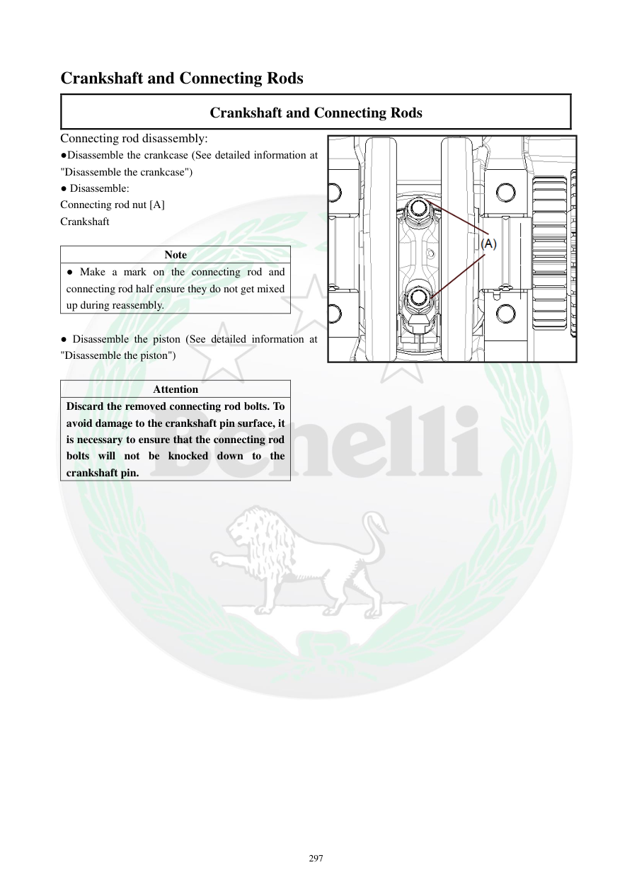

# Manual page 298

> Source: [page-0298.md](../source/page-0298.md)

## Page image / diagram

- [page-0298-img-01.png](../images/embedded/page-0298-img-01.png)

## Extracted text

# Source page 298

 
297 
Crankshaft and Connecting Rods 
Crankshaft and Connecting Rods 
Connecting rod disassembly: 
●Disassemble the crankcase (See detailed information at 
"Disassemble the crankcase") 
● Disassemble: 
Connecting rod nut [A] 
Crankshaft 
 
Note 
● Make a mark on the connecting rod and 
connecting rod half ensure they do not get mixed 
up during reassembly. 
 
● Disassemble the piston (See detailed information at 
"Disassemble the piston") 
 
Attention 
Discard the removed connecting rod bolts. To 
avoid damage to the crankshaft pin surface, it 
is necessary to ensure that the connecting rod 
bolts will not be knocked down to the 
crankshaft pin.

## Persian notes

### بازکردن شاتون
- ابتدا پوسته موتور و سپس پیستون طبق بخش‌های مربوط باز شوند.
- مهره شاتون **[A]** باز و مجموعه شاتون از میل‌لنگ جدا شود.
- روی شاتون و نیمه کپه شاتون علامت بزنید تا هنگام مونتاژ با هم یا با سیلندر دیگر جابه‌جا نشوند.
- **پیچ‌های شاتون پس از بازکردن باید دور انداخته شوند و استفاده مجدد ممنوع است.**
- هنگام بازکردن مراقب باشید پیچ شاتون به سطح پین میل‌لنگ ضربه نزند، چون می‌تواند سطح پین را آسیب بزند.
