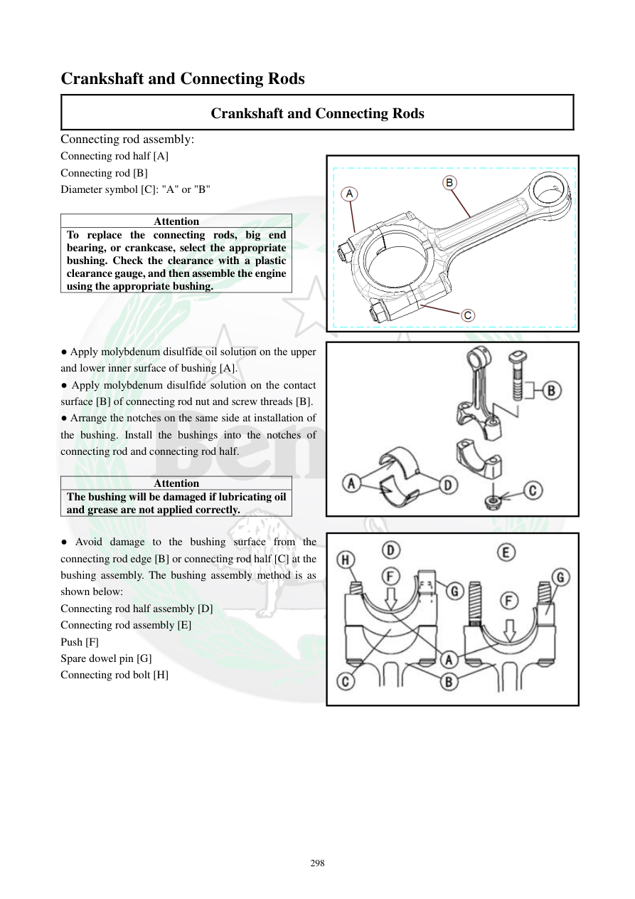

# Manual page 299

> Source: [page-0299.md](../source/page-0299.md)

## Page image / diagram

- [page-0299-img-01.png](../images/embedded/page-0299-img-01.png)

- [page-0299-img-02.jpeg](../images/embedded/page-0299-img-02.jpeg)

- [page-0299-img-03.jpeg](../images/embedded/page-0299-img-03.jpeg)

## Extracted text

# Source page 299

 
298 
Crankshaft and Connecting Rods 
Crankshaft and Connecting Rods 
Connecting rod assembly: 
Connecting rod half [A] 
Connecting rod [B] 
Diameter symbol [C]: "A" or "B" 
 
Attention 
To replace the connecting rods, big end 
bearing, or crankcase, select the appropriate 
bushing. Check the clearance with a plastic 
clearance gauge, and then assemble the engine 
using the appropriate bushing.  
 
 
 
● Apply molybdenum disulfide oil solution on the upper 
and lower inner surface of bushing [A].  
● Apply molybdenum disulfide solution on the contact 
surface [B] of connecting rod nut and screw threads [B].  
● Arrange the notches on the same side at installation of 
the bushing. Install the bushings into the notches of 
connecting rod and connecting rod half.  
 
Attention 
The bushing will be damaged if lubricating oil 
and grease are not applied correctly.   
 
● Avoid damage to the bushing surface from the 
connecting rod edge [B] or connecting rod half [C] at the 
bushing assembly. The bushing assembly method is as 
shown below:  
Connecting rod half assembly [D] 
Connecting rod assembly [E]  
Push [F] 
Spare dowel pin [G] 
Connecting rod bolt [H]

## Persian notes

### مونتاژ شاتون و بوش انتهای بزرگ
- برای تعویض شاتون، بوش انتهای بزرگ یا پوسته موتور، بوش مناسب را بر اساس اندازه‌گیری و **Plastigauge** انتخاب کنید.
- روی سطوح داخلی بالایی و پایینی بوش، محلول **مولیبدن دی‌سولفید** اعمال شود.
- روی سطح تماس مهره شاتون و رزوه پیچ نیز محلول مولیبدن اعمال شود.
- شیارهای بوش‌ها هنگام نصب باید در یک سمت قرار گیرند و در شیارهای شاتون و کپه بنشینند.
- بدون روانکاری صحیح، بوش ممکن است آسیب ببیند.
- لبه شاتون و کپه نباید هنگام نصب به سطح بوش صدمه بزنند.
- جهت قرارگیری کپه، شاتون، پین راهنما و پیچ‌ها مطابق تصویر صفحه رعایت شود.
