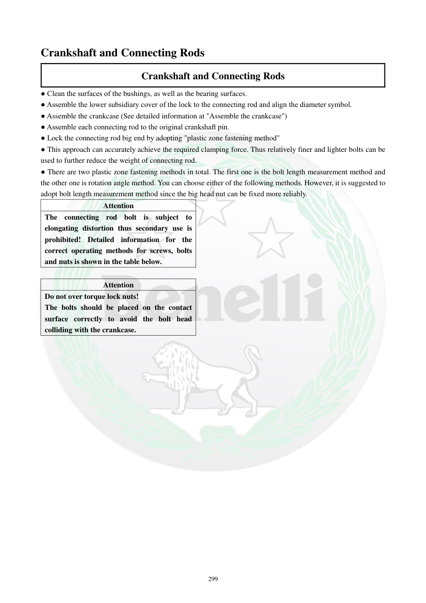

# Manual page 300

> Source: [page-0300.md](../source/page-0300.md)

## Page image / diagram

## Extracted text

# Source page 300

 
299 
Crankshaft and Connecting Rods 
Crankshaft and Connecting Rods 
● Clean the surfaces of the bushings, as well as the bearing surfaces.  
● Assemble the lower subsidiary cover of the lock to the connecting rod and align the diameter symbol.   
● Assemble the crankcase (See detailed information at "Assemble the crankcase") 
● Assemble each connecting rod to the original crankshaft pin. 
● Lock the connecting rod big end by adopting "plastic zone fastening method"  
● This approach can accurately achieve the required clamping force. Thus relatively finer and lighter bolts can be 
used to further reduce the weight of connecting rod.   
● There are two plastic zone fastening methods in total. The first one is the bolt length measurement method and 
the other one is rotation angle method. You can choose either of the following methods. However, it is suggested to 
adopt bolt length measurement method since the big head nut can be fixed more reliably.  
Attention 
The connecting rod bolt is subject to 
elongating distortion thus secondary use is 
prohibited! Detailed information for the 
correct operating methods for screws, bolts 
and nuts is shown in the table below.  
 
Attention 
Do not over torque lock nuts!  
The bolts should be placed on the contact 
surface correctly to avoid the bolt head 
colliding with the crankcase.

## Persian notes

### سفت‌کردن شاتون با روش ناحیه پلاستیک
- اتصال انتهای بزرگ شاتون با روش **Plastic Zone Fastening** سفت می‌شود تا نیروی گیره‌ای دقیق حاصل شود.
- دو روش وجود دارد: **اندازه‌گیری افزایش طول پیچ** و **روش زاویه چرخش**. دفترچه روش اندازه‌گیری طول پیچ را مطمئن‌تر می‌داند.
- **پیچ شاتون پس از کشیدگی تغییر شکل می‌دهد و استفاده مجدد از آن ممنوع است.**
- از بیش‌ازحد سفت‌کردن مهره شاتون خودداری کنید.
- سر پیچ باید کاملاً روی سطح تماس قرار گیرد تا با پوسته موتور برخورد نکند.
