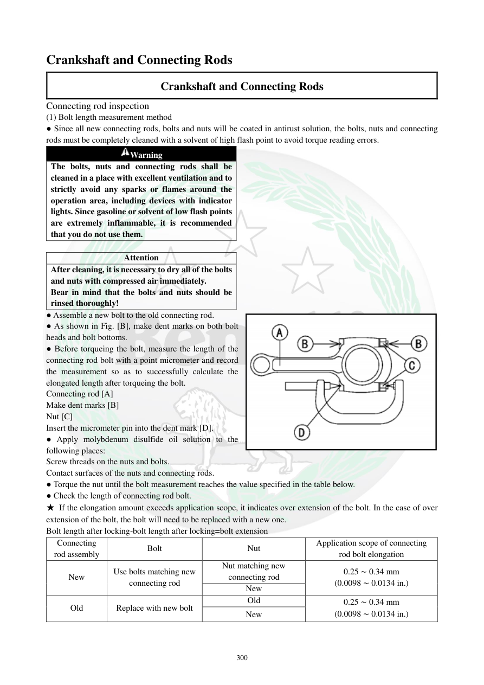

# Manual page 301

> Source: [page-0301.md](../source/page-0301.md)

## Page image / diagram

- [page-0301-img-01.png](../images/embedded/page-0301-img-01.png)

- [page-0301-img-02.png](../images/embedded/page-0301-img-02.png)

## Extracted text

# Source page 301

 
300 
Crankshaft and Connecting Rods 
Crankshaft and Connecting Rods 
Connecting rod inspection 
(1) Bolt length measurement method 
● Since all new connecting rods, bolts and nuts will be coated in antirust solution, the bolts, nuts and connecting 
rods must be completely cleaned with a solvent of high flash point to avoid torque reading errors.  
Warning 
The bolts, nuts and connecting rods shall be 
cleaned in a place with excellent ventilation and to 
strictly avoid any sparks or flames around the 
operation area, including devices with indicator 
lights. Since gasoline or solvent of low flash points 
are extremely inflammable, it is recommended 
that you do not use them.  
 
Attention 
After cleaning, it is necessary to dry all of the bolts 
and nuts with compressed air immediately.  
Bear in mind that the bolts and nuts should be 
rinsed thoroughly!  
● Assemble a new bolt to the old connecting rod.  
● As shown in Fig. [B], make dent marks on both bolt 
heads and bolt bottoms.  
● Before torqueing the bolt, measure the length of the 
connecting rod bolt with a point micrometer and record 
the measurement so as to successfully calculate the 
elongated length after torqueing the bolt.  
Connecting rod [A] 
Make dent marks [B] 
Nut [C] 
Insert the micrometer pin into the dent mark [D].  
● Apply molybdenum disulfide oil solution to the 
following places: 
Screw threads on the nuts and bolts. 
Contact surfaces of the nuts and connecting rods. 
● Torque the nut until the bolt measurement reaches the value specified in the table below.  
● Check the length of connecting rod bolt. 
★ If the elongation amount exceeds application scope, it indicates over extension of the bolt. In the case of over 
extension of the bolt, the bolt will need to be replaced with a new one.  
Bolt length after locking-bolt length after locking=bolt extension  
Connecting 
rod assembly 
Bolt 
Nut 
Application scope of connecting 
rod bolt elongation 
New 
Use bolts matching new 
connecting rod 
Nut matching new 
connecting rod 
0.25 ∼ 0.34 mm 
(0.0098 ∼ 0.0134 in.) 
New 
Old 
Replace with new bolt 
Old 
0.25 ∼ 0.34 mm 
(0.0098 ∼ 0.0134 in.) 
New

## Persian notes

### کنترل کشیدگی پیچ شاتون، روش اندازه‌گیری طول
- پیچ‌ها، مهره‌ها و شاتون‌های نو ممکن است با ماده ضدزنگ پوشیده باشند؛ قبل از اندازه‌گیری باید با **حلال با نقطه اشتعال بالا** کاملاً تمیز شوند.
- کار باید در محیط با تهویه مناسب و دور از هرگونه جرقه یا شعله انجام شود؛ دفترچه استفاده از **بنزین و حلال‌های کم‌نقطه‌اشتعال** را توصیه نمی‌کند.
- بعد از شست‌وشو، پیچ و مهره‌ها فوراً با هوای فشرده خشک شوند.
- پیچ نو را روی شاتون قدیمی نصب کنید، روی سر و انتهای پیچ علامت/فرورفتگی ایجاد کنید و طول اولیه را با **Point Micrometer** اندازه بگیرید.
- محلول مولیبدن روی رزوه پیچ و مهره و سطوح تماس مهره و شاتون اعمال شود.
- پس از سفت‌کردن، افزایش طول پیچ را محاسبه کنید: **طول پس از سفت‌کردن − طول اولیه = میزان کشیدگی پیچ**.
- محدوده مجاز کشیدگی: **0.25 تا 0.34 mm (0.0098 تا 0.0134 in.)**.
- اگر کشیدگی از این محدوده بیشتر شود، پیچ بیش‌ازحد کش آمده و باید با پیچ نو تعویض شود.
- ترکیب نو/قدیمی پیچ، مهره و شاتون باید طبق جدول تصویری صفحه انتخاب شود.
