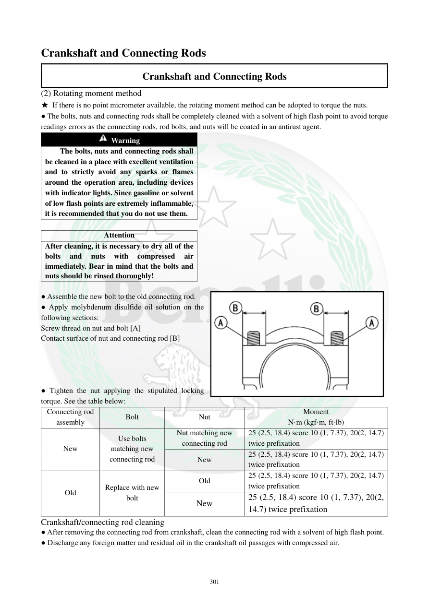

# Manual page 302

> Source: [page-0302.md](../source/page-0302.md)

## Page image / diagram

- [page-0302-img-02.png](../images/embedded/page-0302-img-02.png)

## Extracted text

# Source page 302

 
301 
Crankshaft and Connecting Rods 
Crankshaft and Connecting Rods 
(2) Rotating moment method 
★ If there is no point micrometer available, the rotating moment method can be adopted to torque the nuts.  
● The bolts, nuts and connecting rods shall be completely cleaned with a solvent of high flash point to avoid torque 
readings errors as the connecting rods, rod bolts, and nuts will be coated in an antirust agent.  
 Warning 
The bolts, nuts and connecting rods shall 
be cleaned in a place with excellent ventilation 
and to strictly avoid any sparks or flames 
around the operation area, including devices 
with indicator lights. Since gasoline or solvent 
of low flash points are extremely inflammable, 
it is recommended that you do not use them. 
 
Attention 
After cleaning, it is necessary to dry all of the 
bolts 
and 
nuts 
with 
compressed 
air 
immediately. Bear in mind that the bolts and 
nuts should be rinsed thoroughly! 
 
● Assemble the new bolt to the old connecting rod.  
● Apply molybdenum disulfide oil solution on the 
following sections: 
Screw thread on nut and bolt [A] 
Contact surface of nut and connecting rod [B] 
 
 
 
 
● Tighten the nut applying the stipulated locking 
torque. See the table below:  
Connecting rod 
assembly 
Bolt 
Nut 
Moment 
N·m (kgf·m, ft·lb) 
New 
Use bolts 
matching new 
connecting rod 
Nut matching new 
connecting rod 
25 (2.5, 18.4) score 10 (1, 7.37), 20(2, 14.7) 
twice prefixation 
New 
25 (2.5, 18.4) score 10 (1, 7.37), 20(2, 14.7) 
twice prefixation 
Old 
Replace with new 
bolt 
Old 
25 (2.5, 18.4) score 10 (1, 7.37), 20(2, 14.7) 
twice prefixation 
New 
25 (2.5, 18.4) score 10 (1, 7.37), 20(2, 
14.7) twice prefixation 
Crankshaft/connecting rod cleaning 
● After removing the connecting rod from crankshaft, clean the connecting rod with a solvent of high flash point.  
● Discharge any foreign matter and residual oil in the crankshaft oil passages with compressed air.

## Persian notes

### سفت‌کردن شاتون با روش گشتاور/زاویه
- اگر **Point Micrometer** در دسترس نباشد، روش گشتاور چرخشی دفترچه قابل استفاده است.
- تمیزکاری پیچ، مهره و شاتون با حلال با نقطه اشتعال بالا انجام شود و سپس با هوای فشرده خشک شوند.
- روی رزوه پیچ و مهره و سطح تماس مهره با شاتون، محلول مولیبدن دی‌سولفید اعمال شود.
- گشتاور اولیه: **10 N·m = 1 kgf·m = 7.37 ft·lb**، سپس مرحله دوم **20 N·m = 2 kgf·m = 14.7 ft·lb**؛ جدول استخراج‌شده این دو مرحله را دوبار/دو مرحله پیش‌سفت‌کردن نشان می‌دهد.
- گشتاور نهایی درج‌شده: **25 N·m = 2.5 kgf·m = 18.4 ft·lb**.
- چون متن OCR جدول ترتیب ستون‌ها را ناقص استخراج کرده، برای تشخیص ترکیب دقیق پیچ/مهره نو و قدیمی **تصویر اصلی صفحه مرجع نهایی** است.
- پس از جداسازی شاتون، مجاری روغن میل‌لنگ با هوای فشرده از هرگونه آلودگی و روغن باقیمانده پاک شوند.
