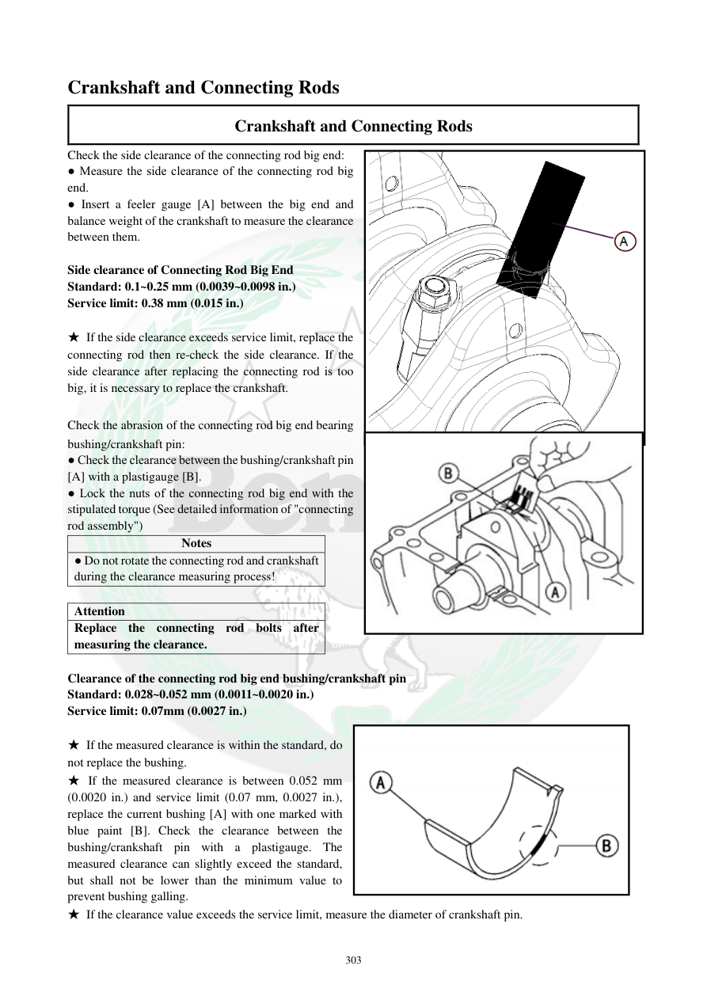

# Manual page 304

> Source: [page-0304.md](../source/page-0304.md)

## Page image / diagram

- [page-0304-img-01.png](../images/embedded/page-0304-img-01.png)

- [page-0304-img-02.png](../images/embedded/page-0304-img-02.png)

- [page-0304-img-03.jpeg](../images/embedded/page-0304-img-03.jpeg)

## Extracted text

# Source page 304

 
303 
Crankshaft and Connecting Rods 
Crankshaft and Connecting Rods 
Check the side clearance of the connecting rod big end: 
● Measure the side clearance of the connecting rod big 
end. 
● Insert a feeler gauge [A] between the big end and 
balance weight of the crankshaft to measure the clearance 
between them.  
 
Side clearance of Connecting Rod Big End 
Standard: 0.1~0.25 mm (0.0039~0.0098 in.)  
Service limit: 0.38 mm (0.015 in.) 
 
★ If the side clearance exceeds service limit, replace the 
connecting rod then re-check the side clearance. If the 
side clearance after replacing the connecting rod is too 
big, it is necessary to replace the crankshaft.  
 
Check the abrasion of the connecting rod big end bearing 
bushing/crankshaft pin: 
● Check the clearance between the bushing/crankshaft pin 
[A] with a plastigauge [B].  
● Lock the nuts of the connecting rod big end with the 
stipulated torque (See detailed information of "connecting 
rod assembly") 
Notes 
● Do not rotate the connecting rod and crankshaft 
during the clearance measuring process!  
 
Attention 
Replace the connecting rod bolts after 
measuring the clearance.  
 
Clearance of the connecting rod big end bushing/crankshaft pin 
Standard: 0.028~0.052 mm (0.0011~0.0020 in.) 
Service limit: 0.07mm (0.0027 in.) 
 
★ If the measured clearance is within the standard, do 
not replace the bushing.  
★ If the measured clearance is between 0.052 mm 
(0.0020 in.) and service limit (0.07 mm, 0.0027 in.), 
replace the current bushing [A] with one marked with 
blue paint [B]. Check the clearance between the 
bushing/crankshaft pin with a plastigauge. The 
measured clearance can slightly exceed the standard, 
but shall not be lower than the minimum value to 
prevent bushing galling.  
★ If the clearance value exceeds the service limit, measure the diameter of crankshaft pin.

## Persian notes

### لقی جانبی و لقی بوش انتهای بزرگ شاتون
- لقی جانبی انتهای بزرگ شاتون را با فیلر بین انتهای بزرگ و وزنه میل‌لنگ اندازه بگیرید.
- استاندارد: **0.10 تا 0.25 mm**؛ حد سرویس **0.38 mm**.
- اگر از حد عبور کرد، ابتدا شاتون را تعویض و دوباره اندازه‌گیری کنید؛ اگر هنوز زیاد بود، میل‌لنگ باید تعویض شود.
- لقی بوش انتهای بزرگ شاتون نسبت به پین میل‌لنگ با **Plastigauge** اندازه‌گیری شود.
- هنگام اندازه‌گیری، شاتون و میل‌لنگ **نباید بچرخند**.
- استاندارد: **0.028 تا 0.052 mm**؛ حد سرویس **0.07 mm**.
- اگر لقی در محدوده استاندارد باشد، بوش تعویض نمی‌شود.
- اگر لقی بین **0.052 و 0.07 mm** باشد، دفترچه تعویض بوش فعلی با بوش دارای **علامت رنگ آبی** و سپس اندازه‌گیری مجدد با Plastigauge را توصیه می‌کند.
- اگر لقی از 0.07 mm بیشتر باشد، قطر پین میل‌لنگ باید اندازه‌گیری شود.
- **بعد از اندازه‌گیری، پیچ‌های شاتون باید با پیچ نو تعویض شوند.**
