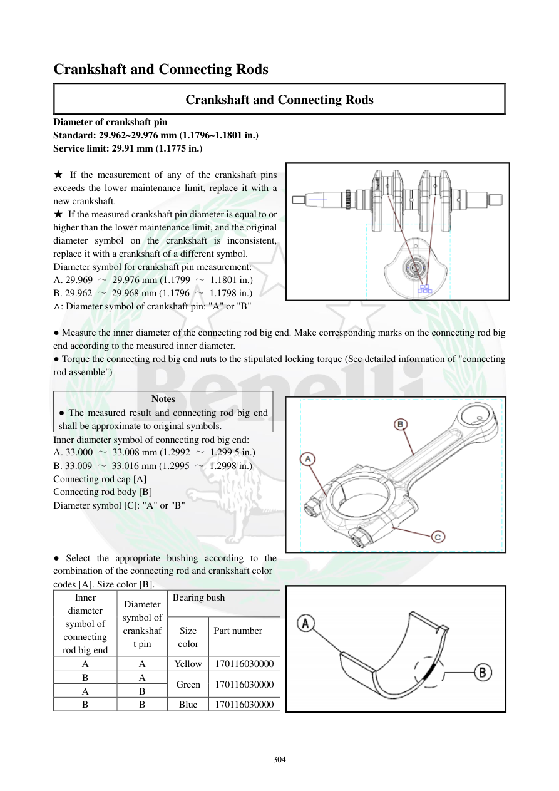

# Manual page 305

> Source: [page-0305.md](../source/page-0305.md)

## Page image / diagram

- [page-0305-img-01.png](../images/embedded/page-0305-img-01.png)

- [page-0305-img-02.png](../images/embedded/page-0305-img-02.png)

- [page-0305-img-03.png](../images/embedded/page-0305-img-03.png)

## Extracted text

# Source page 305

 
304 
Crankshaft and Connecting Rods 
Crankshaft and Connecting Rods 
Diameter of crankshaft pin 
Standard: 29.962~29.976 mm (1.1796~1.1801 in.) 
Service limit: 29.91 mm (1.1775 in.)  
 
★ If the measurement of any of the crankshaft pins 
exceeds the lower maintenance limit, replace it with a 
new crankshaft.  
★ If the measured crankshaft pin diameter is equal to or 
higher than the lower maintenance limit, and the original 
diameter symbol on the crankshaft is inconsistent, 
replace it with a crankshaft of a different symbol.   
Diameter symbol for crankshaft pin measurement: 
A. 29.969 ～ 29.976 mm (1.1799 ～ 1.1801 in.) 
B. 29.962 ～ 29.968 mm (1.1796 ～ 1.1798 in.) 
△: Diameter symbol of crankshaft pin: "A" or "B" 
 
● Measure the inner diameter of the connecting rod big end. Make corresponding marks on the connecting rod big 
end according to the measured inner diameter.  
● Torque the connecting rod big end nuts to the stipulated locking torque (See detailed information of "connecting 
rod assemble") 
 
Notes 
● The measured result and connecting rod big end 
shall be approximate to original symbols.  
Inner diameter symbol of connecting rod big end:  
A. 33.000 ～ 33.008 mm (1.2992 ～ 1.299 5 in.) 
B. 33.009 ～ 33.016 mm (1.2995 ～ 1.2998 in.) 
Connecting rod cap [A] 
Connecting rod body [B] 
Diameter symbol [C]: "A" or "B" 
 
 
 
● Select the appropriate bushing according to the 
combination of the connecting rod and crankshaft color  
codes [A]. Size color [B]. 
Inner 
diameter 
symbol of 
connecting 
rod big end 
Diameter 
symbol of 
crankshaf
t pin 
Bearing bush 
 
Size 
color 
Part number 
 
A 
A 
Yellow 
170116030000 
B 
A 
Green 
170116030000 
A 
B 
B 
B 
Blue 
170116030000

## Persian notes

<!-- Persian translation/explanation will be added here. -->
