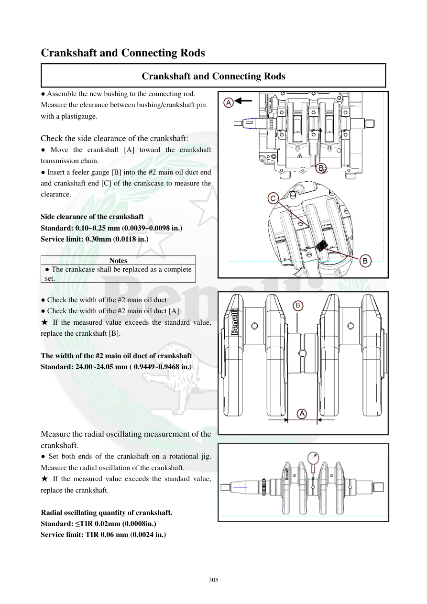

# Manual page 306

> Source: [page-0306.md](../source/page-0306.md)

## Page image / diagram

- [page-0306-img-01.png](../images/embedded/page-0306-img-01.png)

- [page-0306-img-02.png](../images/embedded/page-0306-img-02.png)

- [page-0306-img-03.png](../images/embedded/page-0306-img-03.png)

## Extracted text

# Source page 306

 
305 
Crankshaft and Connecting Rods 
Crankshaft and Connecting Rods 
● Assemble the new bushing to the connecting rod. 
Measure the clearance between bushing/crankshaft pin 
with a plastigauge.  
 
Check the side clearance of the crankshaft:  
● Move the crankshaft [A] toward the crankshaft 
transmission chain.  
● Insert a feeler gauge [B] into the #2 main oil duct end 
and crankshaft end [C] of the crankcase to measure the 
clearance.  
 
Side clearance of the crankshaft 
Standard: 0.10~0.25 mm (0.0039~0.0098 in.) 
Service limit: 0.30mm (0.0118 in.) 
 
Notes 
● The crankcase shall be replaced as a complete 
set.  
 
● Check the width of the #2 main oil duct 
● Check the width of the #2 main oil duct [A] 
★ If the measured value exceeds the standard value, 
replace the crankshaft [B].  
 
The width of the #2 main oil duct of crankshaft 
Standard: 24.00~24.05 mm ( 0.9449~0.9468 in.) 
 
 
 
 
 
Measure the radial oscillating measurement of the 
crankshaft.  
● Set both ends of the crankshaft on a rotational jig. 
Measure the radial oscillation of the crankshaft.  
★ If the measured value exceeds the standard value, 
replace the crankshaft.  
 
Radial oscillating quantity of crankshaft.  
Standard: ≤TIR 0.02mm (0.0008in.) 
Service limit: TIR 0.06 mm (0.0024 in.)

## Persian notes

### کنترل لقی جانبی و لنگی میل‌لنگ
- پس از نصب بوش نو، لقی بین بوش و پین میل‌لنگ با **Plastigauge** کنترل شود.
- برای کنترل لقی جانبی میل‌لنگ، میل‌لنگ را به سمت زنجیر انتقال حرکت دهید و فیلر را بین انتهای مجرای اصلی روغن شماره **2** و انتهای میل‌لنگ داخل پوسته قرار دهید.
- لقی جانبی میل‌لنگ: استاندارد **0.10 تا 0.25 mm**؛ حد سرویس **0.30 mm**.
- نیمه‌های پوسته موتور باید به‌صورت **یک مجموعه کامل** تعویض شوند، نه جداگانه.
- عرض مجرای اصلی روغن شماره 2 میل‌لنگ: استاندارد **24.00 تا 24.05 mm**؛ اگر خارج از مقدار مشخص باشد، میل‌لنگ تعویض شود.
- برای کنترل لنگی شعاعی، دو انتهای میل‌لنگ روی فیکسچر چرخان قرار گرفته و TIR اندازه‌گیری شود.
- استاندارد لنگی شعاعی: **≤ TIR 0.02 mm**؛ حد سرویس **TIR 0.06 mm**.
- در صورت عبور از حد سرویس، میل‌لنگ باید تعویض شود.
