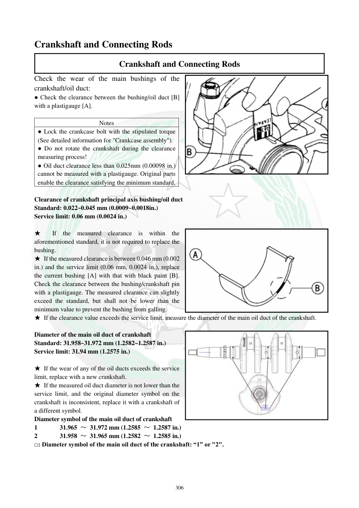

# Manual page 307

> Source: [page-0307.md](../source/page-0307.md)

## Page image / diagram

- [page-0307-img-01.png](../images/embedded/page-0307-img-01.png)

- [page-0307-img-02.png](../images/embedded/page-0307-img-02.png)

- [page-0307-img-03.jpeg](../images/embedded/page-0307-img-03.jpeg)

## Extracted text

# Source page 307

 
306 
Crankshaft and Connecting Rods 
Crankshaft and Connecting Rods 
Check the wear of the main bushings of the 
crankshaft/oil duct:  
● Check the clearance between the bushing/oil duct [B] 
with a plastigauge [A].  
 
Notes 
● Lock the crankcase bolt with the stipulated torque 
(See detailed information for "Crankcase assembly").  
● Do not rotate the crankshaft during the clearance 
measuring process!  
● Oil duct clearance less than 0.025mm (0.00098 in.) 
cannot be measured with a plastigauge. Original parts 
enable the clearance satisfying the minimum standard.  
 
Clearance of crankshaft principal axis bushing/oil duct 
Standard: 0.022~0.045 mm (0.0009~0.0018in.) 
Service limit: 0.06 mm (0.0024 in.) 
 
★ 
If the measured clearance is within the 
aforementioned standard, it is not required to replace the 
bushing.  
★ If the measured clearance is between 0.046 mm (0.002 
in.) and the service limit (0.06 mm, 0.0024 in.), replace 
the current bushing [A] with that with black paint [B]. 
Check the clearance between the bushing/crankshaft pin 
with a plastigauge. The measured clearance can slightly 
exceed the standard, but shall not be lower than the 
minimum value to prevent the bushing from galling.  
★ If the clearance value exceeds the service limit, measure the diameter of the main oil duct of the crankshaft.  
 
Diameter of the main oil duct of crankshaft 
Standard: 31.958~31.972 mm (1.2582~1.2587 in.) 
Service limit: 31.94 mm (1.2575 in.) 
 
★ If the wear of any of the oil ducts exceeds the service 
limit, replace with a new crankshaft.  
★ If the measured oil duct diameter is not lower than the 
service limit, and the original diameter symbol on the 
crankshaft is inconsistent, replace it with a crankshaft of 
a different symbol.   
Diameter symbol of the main oil duct of crankshaft 
1       31.965 ～ 31.972 mm (1.2585 ～ 1.2587 in.) 
2       31.958 ～ 31.965 mm (1.2582 ～ 1.2585 in.) 
□: Diameter symbol of the main oil duct of the crankshaft: “1” or "2".

## Persian notes

### کنترل بوش‌های اصلی میل‌لنگ
- لقی بین بوش اصلی و مسیر اصلی روغن میل‌لنگ با **Plastigauge** اندازه‌گیری شود.
- هنگام اندازه‌گیری، میل‌لنگ **نباید بچرخد**.
- لقی کمتر از **0.025 mm** با Plastigauge قابل اندازه‌گیری نیست و قطعات اصلی کارخانه‌ای باید حداقل لقی را تأمین کنند.
- لقی استاندارد بوش اصلی/مسیر روغن: **0.022 تا 0.045 mm**؛ حد سرویس **0.06 mm**.
- اگر لقی در محدوده استاندارد باشد، بوش تعویض نمی‌شود.
- اگر لقی بین **0.046 و 0.06 mm** باشد، دفترچه تعویض بوش فعلی با بوش دارای **رنگ مشکی** و اندازه‌گیری مجدد را توصیه می‌کند. لقی می‌تواند کمی بالاتر از استاندارد باشد، اما نباید از حداقل لازم کمتر شود تا بوش گیرپاژ نکند.
- اگر لقی از حد سرویس بیشتر باشد، قطر مسیر اصلی روغن میل‌لنگ اندازه‌گیری شود.
- قطر مسیر اصلی روغن میل‌لنگ: استاندارد **31.958 تا 31.972 mm**؛ حد سرویس **31.94 mm**.
- علامت قطر مسیر اصلی:
  - **1: 31.965 تا 31.972 mm**
  - **2: 31.958 تا 31.965 mm**
- اگر هر مسیر از حد سرویس فرسوده‌تر باشد، میل‌لنگ نو لازم است؛ اگر قطر هنوز در حد مجاز است ولی علامت اصلی ناسازگار است، میل‌لنگ با علامت مناسب انتخاب شود.
