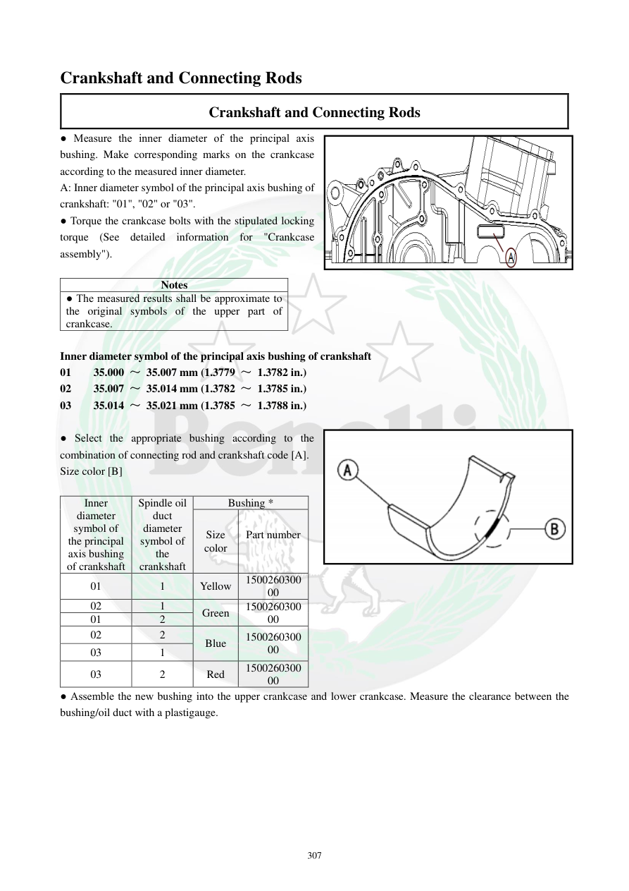

# Manual page 308

> Source: [page-0308.md](../source/page-0308.md)

## Page image / diagram

- [page-0308-img-01.png](../images/embedded/page-0308-img-01.png)

- [page-0308-img-02.png](../images/embedded/page-0308-img-02.png)

## Extracted text

# Source page 308

 
307 
Crankshaft and Connecting Rods 
Crankshaft and Connecting Rods 
● Measure the inner diameter of the principal axis 
bushing. Make corresponding marks on the crankcase 
according to the measured inner diameter.  
A: Inner diameter symbol of the principal axis bushing of 
crankshaft: "01", "02" or "03".  
● Torque the crankcase bolts with the stipulated locking 
torque (See detailed information for "Crankcase 
assembly").  
 
Notes 
● The measured results shall be approximate to 
the original symbols of the upper part of 
crankcase.  
 
Inner diameter symbol of the principal axis bushing of crankshaft 
01    35.000 ～ 35.007 mm (1.3779 ～ 1.3782 in.) 
02    35.007 ～ 35.014 mm (1.3782 ～ 1.3785 in.) 
03    35.014 ～ 35.021 mm (1.3785 ～ 1.3788 in.) 
 
● Select the appropriate bushing according to the 
combination of connecting rod and crankshaft code [A].  
Size color [B] 
 
Inner 
diameter 
symbol of 
the principal 
axis bushing 
of crankshaft 
Spindle oil 
duct 
diameter 
symbol of 
the 
crankshaft 
Bushing * 
Size 
color 
Part number 
 
01 
1 
Yellow 
1500260300
00 
02 
1 
Green 
1500260300
00 
01 
2 
02 
2 
Blue 
1500260300
00 
03 
1 
03 
2 
Red 
1500260300
00 
● Assemble the new bushing into the upper crankcase and lower crankcase. Measure the clearance between the 
bushing/oil duct with a plastigauge.

## Persian notes

### انتخاب بوش اصلی میل‌لنگ
- قطر داخلی بوش اصلی را اندازه بگیرید و علامت متناظر **01، 02 یا 03** را روی پوسته ثبت کنید.
- محدوده‌های قطر داخلی پوسته:
  - **01: 35.000 تا 35.007 mm**
  - **02: 35.007 تا 35.014 mm**
  - **03: 35.014 تا 35.021 mm**
- نتیجه اندازه‌گیری باید با علامت اصلی روی نیمه بالایی پوسته نزدیک باشد.
- بوش مناسب بر اساس ترکیب **علامت قطر داخلی پوسته + علامت قطر مسیر اصلی روغن میل‌لنگ** انتخاب می‌شود:
  - 01 + 1 → **زرد**
  - 02 + 1 → **سبز**
  - 01 + 2 → **آبی**
  - 02 + 2 → **آبی**
  - 03 + 1 → **قرمز**
  - 03 + 2 → **قرمز**
- شماره قطعه درج‌شده برای بوش اصلی: **150026030000**.
- پس از نصب بوش نو در نیمه بالایی و پایینی پوسته، لقی بوش با مسیر اصلی روغن میل‌لنگ باید با **Plastigauge** کنترل شود.
