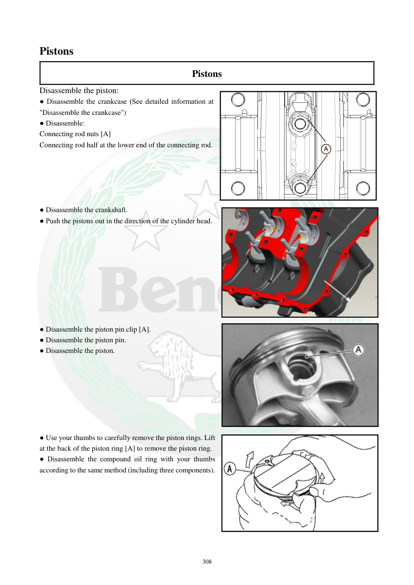

# Manual page 309

> Source: [page-0309.md](../source/page-0309.md)

## Page image / diagram

- [page-0309-img-01.png](../images/embedded/page-0309-img-01.png)

- [page-0309-img-02.jpeg](../images/embedded/page-0309-img-02.jpeg)

- [page-0309-img-03.jpeg](../images/embedded/page-0309-img-03.jpeg)

- [page-0309-img-04.png](../images/embedded/page-0309-img-04.png)

## Extracted text

# Source page 309

 
308 
Pistons 
Pistons 
Disassemble the piston: 
● Disassemble the crankcase (See detailed information at 
"Disassemble the crankcase") 
● Disassemble: 
Connecting rod nuts [A] 
Connecting rod half at the lower end of the connecting rod. 
 
 
 
 
 
● Disassemble the crankshaft.  
● Push the pistons out in the direction of the cylinder head.  
 
 
 
 
 
 
 
 
 
● Disassemble the piston pin clip [A].  
● Disassemble the piston pin.  
● Disassemble the piston.  
 
 
 
 
 
 
 
● Use your thumbs to carefully remove the piston rings. Lift 
at the back of the piston ring [A] to remove the piston ring.  
● Disassemble the compound oil ring with your thumbs 
according to the same method (including three components).

## Persian notes

### باز کردن پیستون
- پس از باز کردن پوسته موتور، مهره‌های شاتون و کپه انتهای بزرگ شاتون باز شوند.
- سپس میل‌لنگ خارج شود.
- پیستون‌ها در جهت **سمت سرسیلندر** از سیلندر خارج شوند.
- خار پین پیستون خارج و سپس پین پیستون و خود پیستون جدا شوند.
- رینگ‌ها را با انگشتان و با احتیاط باز کنید؛ پشت رینگ را کمی بالا آورده و خارج کنید.
- رینگ روغنی چندتکه نیز با همان روش و شامل هر سه جزء جدا شود.
- هنگام بازکردن رینگ‌ها از باز کردن بیش از حد دهانه آنها خودداری کنید تا رینگ یا شیار پیستون آسیب نبیند.
