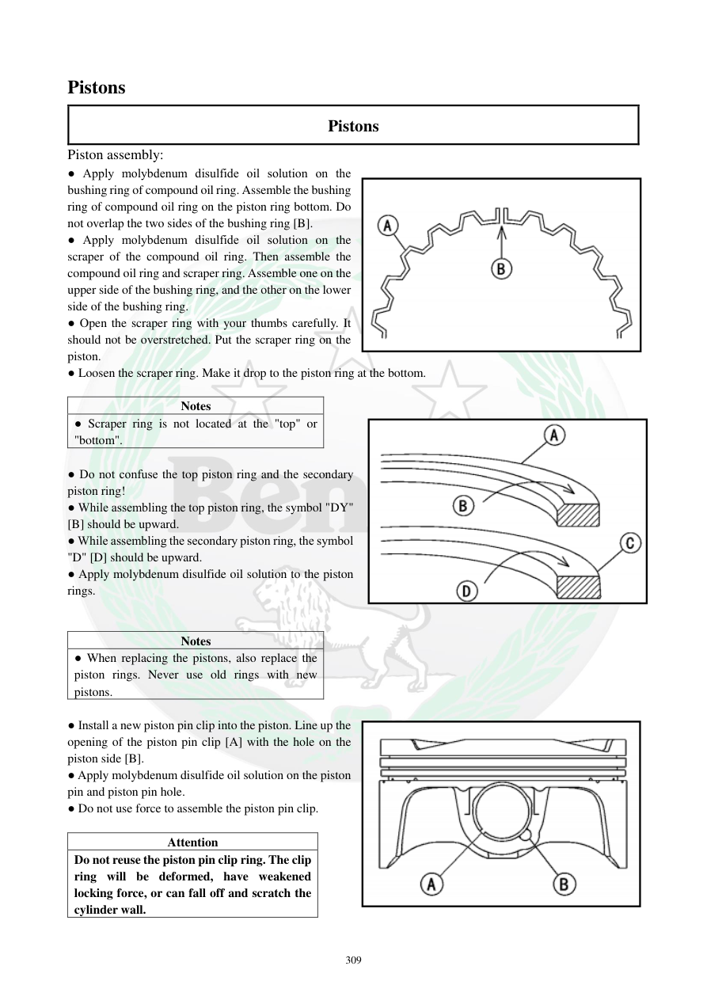

# Manual page 310

> Source: [page-0310.md](../source/page-0310.md)

## Page image / diagram

- [page-0310-img-01.png](../images/embedded/page-0310-img-01.png)

- [page-0310-img-02.png](../images/embedded/page-0310-img-02.png)

- [page-0310-img-03.png](../images/embedded/page-0310-img-03.png)

## Extracted text

# Source page 310

 
309 
Pistons 
Pistons 
Piston assembly:  
● Apply molybdenum disulfide oil solution on the 
bushing ring of compound oil ring. Assemble the bushing 
ring of compound oil ring on the piston ring bottom. Do 
not overlap the two sides of the bushing ring [B].        
● Apply molybdenum disulfide oil solution on the 
scraper of the compound oil ring. Then assemble the 
compound oil ring and scraper ring. Assemble one on the 
upper side of the bushing ring, and the other on the lower 
side of the bushing ring.        
● Open the scraper ring with your thumbs carefully. It 
should not be overstretched. Put the scraper ring on the 
piston.  
● Loosen the scraper ring. Make it drop to the piston ring at the bottom.  
 
Notes 
● Scraper ring is not located at the "top" or 
"bottom".  
 
● Do not confuse the top piston ring and the secondary 
piston ring!  
● While assembling the top piston ring, the symbol "DY" 
[B] should be upward.  
● While assembling the secondary piston ring, the symbol 
"D" [D] should be upward.  
● Apply molybdenum disulfide oil solution to the piston 
rings.  
 
 
Notes 
● When replacing the pistons, also replace the 
piston rings. Never use old rings with new 
pistons.  
 
● Install a new piston pin clip into the piston. Line up the 
opening of the piston pin clip [A] with the hole on the 
piston side [B].  
● Apply molybdenum disulfide oil solution on the piston 
pin and piston pin hole.  
● Do not use force to assemble the piston pin clip.  
 
Attention 
Do not reuse the piston pin clip ring. The clip 
ring will be deformed, have weakened 
locking force, or can fall off and scratch the 
cylinder wall.

## Persian notes

<!-- Persian translation/explanation will be added here. -->
