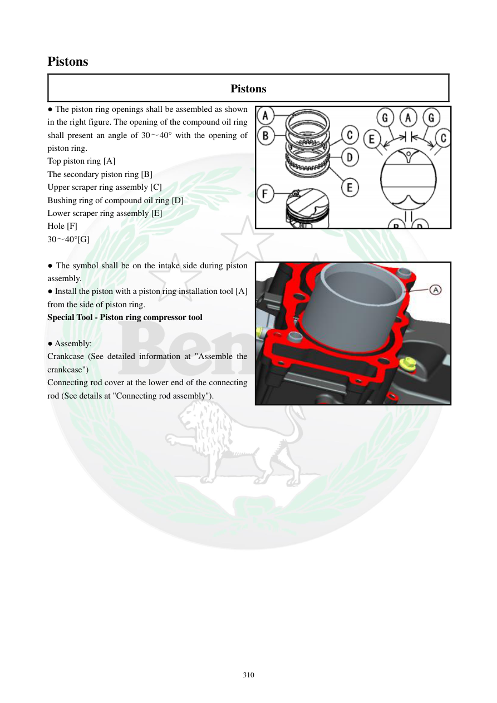

# Manual page 311

> Source: [page-0311.md](../source/page-0311.md)

## Page image / diagram

- [page-0311-img-01.png](../images/embedded/page-0311-img-01.png)

- [page-0311-img-02.jpeg](../images/embedded/page-0311-img-02.jpeg)

## Extracted text

# Source page 311

 
310 
Pistons 
Pistons 
● The piston ring openings shall be assembled as shown 
in the right figure. The opening of the compound oil ring 
shall present an angle of 30～40° with the opening of 
piston ring.   
Top piston ring [A] 
The secondary piston ring [B] 
Upper scraper ring assembly [C]     
Bushing ring of compound oil ring [D] 
Lower scraper ring assembly [E]  
Hole [F] 
30～40°[G] 
 
● The symbol shall be on the intake side during piston 
assembly.  
● Install the piston with a piston ring installation tool [A] 
from the side of piston ring.  
Special Tool - Piston ring compressor tool 
 
● Assembly: 
Crankcase (See detailed information at "Assemble the 
crankcase") 
Connecting rod cover at the lower end of the connecting 
rod (See details at "Connecting rod assembly").

## Persian notes

<!-- Persian translation/explanation will be added here. -->
