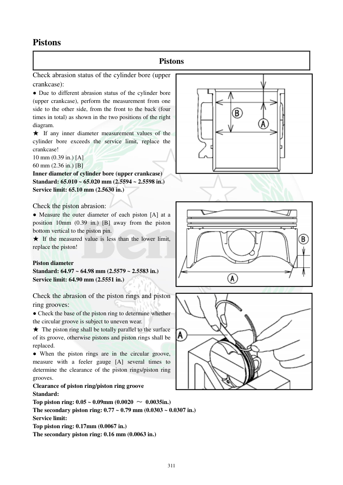

# Manual page 312

> Source: [page-0312.md](../source/page-0312.md)

## Page image / diagram

- [page-0312-img-01.png](../images/embedded/page-0312-img-01.png)

- [page-0312-img-02.png](../images/embedded/page-0312-img-02.png)

- [page-0312-img-03.png](../images/embedded/page-0312-img-03.png)

## Extracted text

# Source page 312

 
311 
Pistons 
Pistons 
Check abrasion status of the cylinder bore (upper 
crankcase): 
● Due to different abrasion status of the cylinder bore 
(upper crankcase), perform the measurement from one 
side to the other side, from the front to the back (four 
times in total) as shown in the two positions of the right 
diagram.  
★ If any inner diameter measurement values of the 
cylinder bore exceeds the service limit, replace the 
crankcase!  
10 mm (0.39 in.) [A] 
60 mm (2.36 in.) [B] 
Inner diameter of cylinder bore (upper crankcase) 
Standard: 65.010 ~ 65.020 mm (2.5594 ~ 2.5598 in.) 
Service limit: 65.10 mm (2.5630 in.) 
 
Check the piston abrasion: 
● Measure the outer diameter of each piston [A] at a 
position 10mm (0.39 in.) [B] away from the piston 
bottom vertical to the piston pin.  
★ If the measured value is less than the lower limit, 
replace the piston!  
 
Piston diameter 
Standard: 64.97 ~ 64.98 mm (2.5579 ~ 2.5583 in.) 
Service limit: 64.90 mm (2.5551 in.) 
 
Check the abrasion of the piston rings and piston 
ring grooves: 
● Check the base of the piston ring to determine whether 
the circular groove is subject to uneven wear.   
★ The piston ring shall be totally parallel to the surface 
of its groove, otherwise pistons and piston rings shall be 
replaced.  
● When the piston rings are in the circular groove, 
measure with a feeler gauge [A] several times to 
determine the clearance of the piston rings/piston ring 
grooves.  
Clearance of piston ring/piston ring groove 
Standard:  
Top piston ring: 0.05 ~ 0.09mm (0.0020 ～ 0.0035in.)   
The secondary piston ring: 0.77 ~ 0.79 mm (0.0303 ~ 0.0307 in.) 
Service limit: 
Top piston ring: 0.17mm (0.0067 in.) 
The secondary piston ring: 0.16 mm (0.0063 in.)

## Persian notes

### اندازه‌گیری سیلندر، پیستون و لقی شیار رینگ
- به علت سایش متفاوت جداره سیلندر، قطر داخلی هر سیلندر در چند جهت و چند نقطه اندازه‌گیری شود. شکل صفحه محل‌های اندازه‌گیری را نشان می‌دهد.
- نقاط اندازه‌گیری شامل فاصله‌های حدود **10 mm و 60 mm** از سمت مرجع شکل هستند.
- قطر داخلی سیلندر:
  - استاندارد: **65.010 تا 65.020 mm**
  - حد سرویس: **65.10 mm**
- اگر هر اندازه‌گیری از حد سرویس بیشتر باشد، طبق دفترچه پوسته موتور/کرنک‌کیس باید تعویض شود.
- قطر پیستون در نقطه **10 mm از پایین پیستون** و در جهت عمود بر محور پین اندازه‌گیری شود:
  - استاندارد: **64.97 تا 64.98 mm**
  - حد سرویس: **64.90 mm**
- اگر قطر پیستون از حد پایین کمتر شود، پیستون تعویض شود.
- لقی رینگ در شیار پیستون:
  - رینگ بالایی: استاندارد **0.05 تا 0.09 mm**، حد سرویس **0.17 mm**
  - رینگ دوم: متن دفترچه **0.77 تا 0.79 mm**، حد سرویس **0.16 mm**
- عدد لقی رینگ دوم در متن استخراج‌شده از نظر فنی غیرعادی به نظر می‌رسد؛ **برای این مقدار تصویر اصلی صفحه ملاک نهایی است** و نباید عدد OCR را بدون بررسی تصویر به‌عنوان مشخصه قطعی استفاده کرد.
