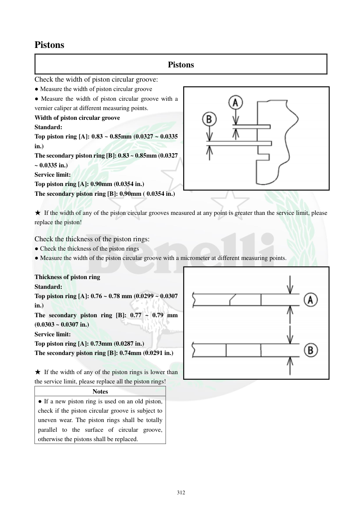

# Manual page 313

> Source: [page-0313.md](../source/page-0313.md)

## Page image / diagram

- [page-0313-img-01.png](../images/embedded/page-0313-img-01.png)

- [page-0313-img-02.png](../images/embedded/page-0313-img-02.png)

## Extracted text

# Source page 313

 
312 
Pistons 
Pistons 
Check the width of piston circular groove: 
● Measure the width of piston circular groove 
● Measure the width of piston circular groove with a 
vernier caliper at different measuring points.  
Width of piston circular groove 
Standard: 
Top piston ring [A]: 0.83 ~ 0.85mm (0.0327 ~ 0.0335 
in.) 
The secondary piston ring [B]: 0.83 ~ 0.85mm (0.0327 
~ 0.0335 in.) 
Service limit: 
Top piston ring [A]: 0.90mm (0.0354 in.) 
The secondary piston ring [B]: 0.90mm ( 0.0354 in.) 
 
★ If the width of any of the piston circular grooves measured at any point is greater than the service limit, please 
replace the piston!  
 
Check the thickness of the piston rings: 
● Check the thickness of the piston rings 
● Measure the width of the piston circular groove with a micrometer at different measuring points.  
 
Thickness of piston ring 
Standard: 
Top piston ring [A]: 0.76 ~ 0.78 mm (0.0299 ~ 0.0307 
in.) 
The secondary piston ring [B]: 0.77 ~ 0.79 mm 
(0.0303 ~ 0.0307 in.) 
Service limit: 
Top piston ring [A]: 0.73mm (0.0287 in.) 
The secondary piston ring [B]: 0.74mm (0.0291 in.) 
 
★ If the width of any of the piston rings is lower than 
the service limit, please replace all the piston rings!  
Notes 
● If a new piston ring is used on an old piston, 
check if the piston circular groove is subject to 
uneven wear. The piston rings shall be totally 
parallel to the surface of circular groove, 
otherwise the pistons shall be replaced.

## Persian notes

### اندازه شیار رینگ و ضخامت رینگ
- عرض شیار هر رینگ را در چند نقطه با کولیس اندازه بگیرید.
- عرض شیار:
  - رینگ بالایی: استاندارد **0.83 تا 0.85 mm**، حد سرویس **0.90 mm**
  - رینگ دوم: استاندارد **0.83 تا 0.85 mm**، حد سرویس **0.90 mm**
- اگر عرض هر نقطه از شیار بیشتر از حد سرویس باشد، پیستون تعویض شود.
- ضخامت رینگ با میکرومتر در چند نقطه اندازه‌گیری شود:
  - رینگ بالایی: استاندارد **0.76 تا 0.78 mm**، حد سرویس **0.73 mm**
  - رینگ دوم: استاندارد **0.77 تا 0.79 mm**، حد سرویس **0.74 mm**
- اگر ضخامت هر رینگ از حد سرویس کمتر باشد، **تمام رینگ‌ها** تعویض شوند.
- اگر رینگ نو روی پیستون قدیمی نصب می‌شود، شیار پیستون از نظر سایش نامتقارن بررسی شود؛ رینگ باید کاملاً موازی کف شیار بنشیند، وگرنه پیستون نیز باید تعویض شود.
