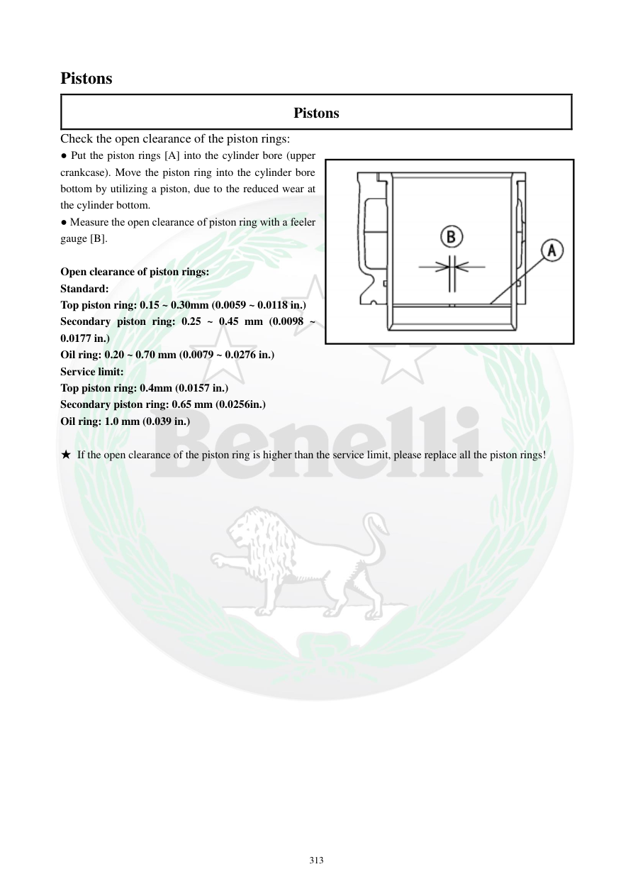

# Manual page 314

> Source: [page-0314.md](../source/page-0314.md)

## Page image / diagram

- [page-0314-img-01.png](../images/embedded/page-0314-img-01.png)

## Extracted text

# Source page 314

 
313 
Pistons 
Pistons 
Check the open clearance of the piston rings:  
● Put the piston rings [A] into the cylinder bore (upper 
crankcase). Move the piston ring into the cylinder bore 
bottom by utilizing a piston, due to the reduced wear at 
the cylinder bottom.   
● Measure the open clearance of piston ring with a feeler 
gauge [B].  
 
Open clearance of piston rings: 
Standard: 
Top piston ring: 0.15 ~ 0.30mm (0.0059 ~ 0.0118 in.) 
Secondary piston ring: 0.25 ~ 0.45 mm (0.0098 ~ 
0.0177 in.) 
Oil ring: 0.20 ~ 0.70 mm (0.0079 ~ 0.0276 in.) 
Service limit: 
Top piston ring: 0.4mm (0.0157 in.) 
Secondary piston ring: 0.65 mm (0.0256in.) 
Oil ring: 1.0 mm (0.039 in.) 
 
★ If the open clearance of the piston ring is higher than the service limit, please replace all the piston rings!

## Persian notes

### اندازه‌گیری دهانه رینگ پیستون
- هر رینگ را داخل سیلندر قرار دهید و با استفاده از پیستون آن را به قسمت پایین‌تر سیلندر برانید، جایی که سایش کمتری دارد.
- دهانه رینگ با فیلر اندازه‌گیری شود.
- لقی دهانه رینگ‌ها:
  - رینگ بالایی: استاندارد **0.15 تا 0.30 mm**، حد سرویس **0.40 mm**
  - رینگ دوم: استاندارد **0.25 تا 0.45 mm**، حد سرویس **0.65 mm**
  - رینگ روغنی: استاندارد **0.20 تا 0.70 mm**، حد سرویس **1.0 mm**
- اگر دهانه هر رینگ از حد سرویس بیشتر باشد، طبق دفترچه **تمام رینگ‌ها تعویض شوند**.
- برای اندازه‌گیری دقیق، رینگ باید در سیلندر کاملاً گونیا و هم‌راستا قرار گرفته باشد؛ شکل صفحه روش قرارگیری را نشان می‌دهد.
