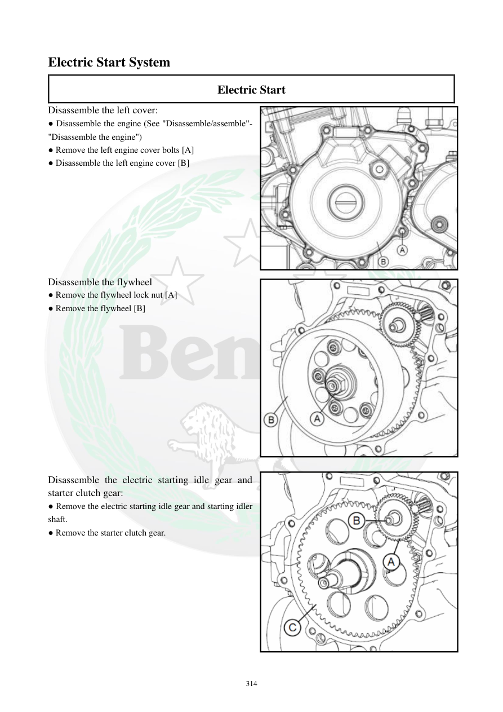

# Manual page 315

> Source: [page-0315.md](../source/page-0315.md)

## Page image / diagram

- [page-0315-img-01.jpeg](../images/embedded/page-0315-img-01.jpeg)

- [page-0315-img-02.jpeg](../images/embedded/page-0315-img-02.jpeg)

- [page-0315-img-03.png](../images/embedded/page-0315-img-03.png)

## Extracted text

# Source page 315

 
314 
Electric Start System 
Electric Start 
Disassemble the left cover: 
● Disassemble the engine (See "Disassemble/assemble"-
"Disassemble the engine")  
● Remove the left engine cover bolts [A] 
● Disassemble the left engine cover [B] 
 
 
 
 
 
 
 
 
Disassemble the flywheel 
● Remove the flywheel lock nut [A] 
● Remove the flywheel [B] 
 
 
 
 
 
 
 
 
 
 
 
 
Disassemble the electric starting idle gear and 
starter clutch gear: 
● Remove the electric starting idle gear and starting idler 
shaft. 
● Remove the starter clutch gear.

## Persian notes

### باز کردن سیستم استارت برقی از سمت چپ موتور
این صفحات مربوط به **سیستم انتقال نیروی استارت** داخل موتور هستند، نه خود موتور استارت که در صفحات 403 تا 408 بررسی شد.

- برای رسیدن به مجموعه استارت، ابتدا طبق دستورالعمل موتور را باز کرده و **کاور سمت چپ موتور** را با باز کردن پیچ‌های آن جدا کنید.
- برای دسترسی به مجموعه فلایویل، **مهره قفل فلایویل** باز و سپس فلایویل خارج می‌شود.
- بعد از آن، **چرخ‌دنده هرزگرد استارت و محور آن** و همچنین **چرخ‌دنده کلاچ استارت** جدا می‌شوند.
- در TNT249 بهتر است قبل از بستن قطعات، شکل قطعات و جهت نصب با قطعه بازشده تطبیق داده شود، چون این دفترچه برای TNT300 است.

### ارتباط با عیب فعلی
اگر موتور استارت سالم بچرخد ولی نیروی استارت به موتور منتقل نشود، فقط تعویض زغال موتور استارت مشکل را حل نمی‌کند و باید **چرخ‌دنده هرزگرد، چرخ‌دنده کلاچ استارت و کلاچ استارت** نیز بررسی شوند.

