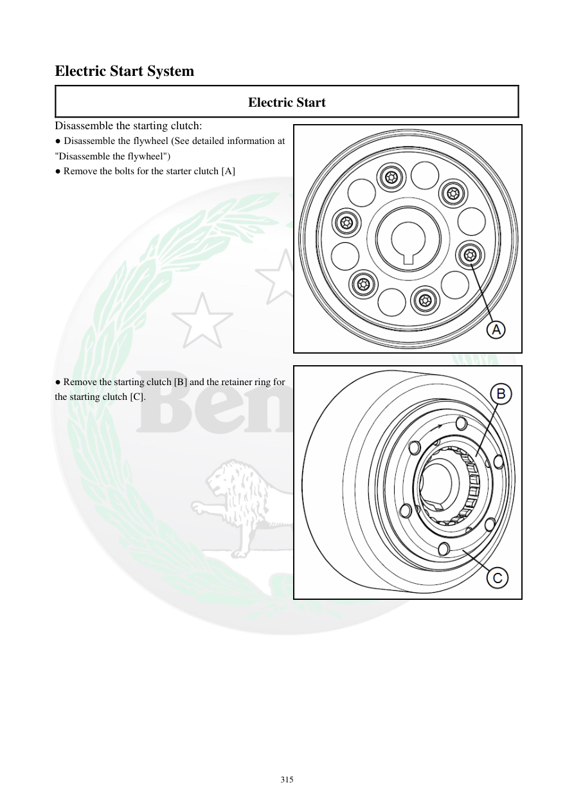

# Manual page 316

> Source: [page-0316.md](../source/page-0316.md)

## Page image / diagram

- [page-0316-img-01.png](../images/embedded/page-0316-img-01.png)

- [page-0316-img-02.png](../images/embedded/page-0316-img-02.png)

## Extracted text

# Source page 316

 
315 
Electric Start System 
Electric Start 
Disassemble the starting clutch: 
● Disassemble the flywheel (See detailed information at 
"Disassemble the flywheel")  
● Remove the bolts for the starter clutch [A] 
 
 
 
 
 
 
 
 
 
 
 
 
 
● Remove the starting clutch [B] and the retainer ring for 
the starting clutch [C].

## Persian notes

<!-- Persian translation/explanation will be added here. -->
