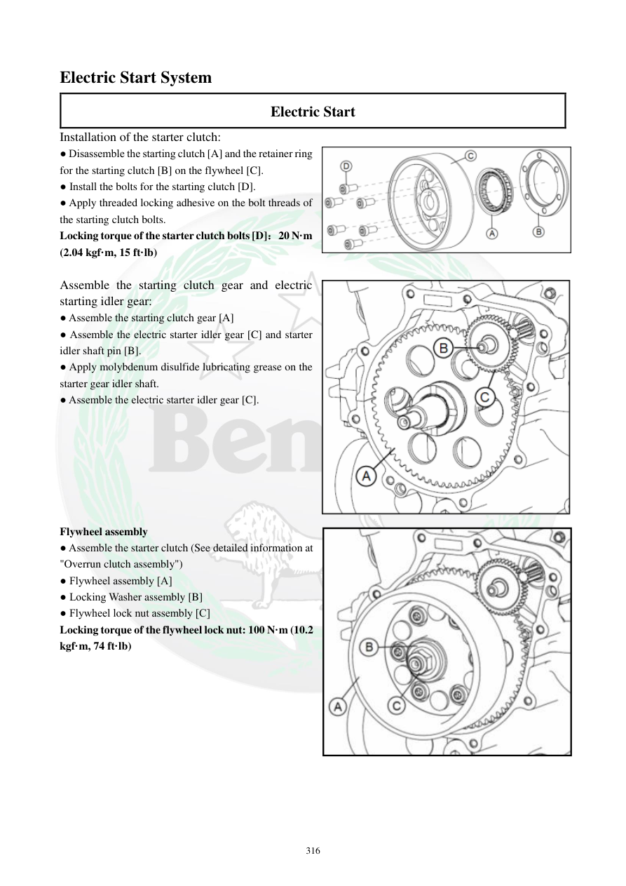

# Manual page 317

> Source: [page-0317.md](../source/page-0317.md)

## Page image / diagram

- [page-0317-img-01.png](../images/embedded/page-0317-img-01.png)

- [page-0317-img-02.png](../images/embedded/page-0317-img-02.png)

- [page-0317-img-03.jpeg](../images/embedded/page-0317-img-03.jpeg)

## Extracted text

# Source page 317

 
316 
Electric Start System 
Electric Start 
Installation of the starter clutch: 
● Disassemble the starting clutch [A] and the retainer ring 
for the starting clutch [B] on the flywheel [C].  
● Install the bolts for the starting clutch [D]. 
● Apply threaded locking adhesive on the bolt threads of 
the starting clutch bolts.  
Locking torque of the starter clutch bolts [D]：20 N·m 
(2.04 kgf·m, 15 ft·lb) 
 
Assemble the starting clutch gear and electric 
starting idler gear: 
● Assemble the starting clutch gear [A] 
● Assemble the electric starter idler gear [C] and starter 
idler shaft pin [B]. 
● Apply molybdenum disulfide lubricating grease on the 
starter gear idler shaft. 
● Assemble the electric starter idler gear [C]. 
 
 
 
 
 
 
 
Flywheel assembly 
● Assemble the starter clutch (See detailed information at 
"Overrun clutch assembly")  
● Flywheel assembly [A] 
● Locking Washer assembly [B] 
● Flywheel lock nut assembly [C]  
Locking torque of the flywheel lock nut: 100 N·m (10.2 
kgf·m, 74 ft·lb)

## Persian notes

<!-- Persian translation/explanation will be added here. -->
