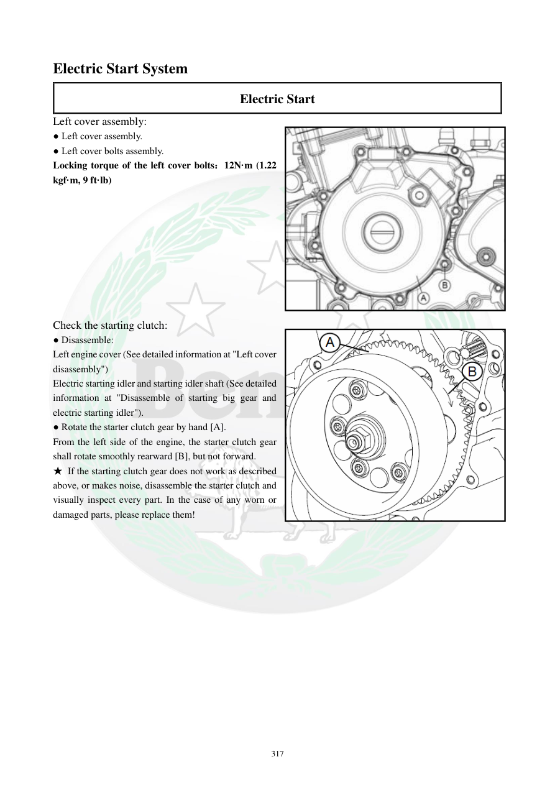

# Manual page 318

> Source: [page-0318.md](../source/page-0318.md)

## Page image / diagram

- [page-0318-img-01.jpeg](../images/embedded/page-0318-img-01.jpeg)

- [page-0318-img-02.png](../images/embedded/page-0318-img-02.png)

## Extracted text

# Source page 318

 
317 
Electric Start System 
Electric Start 
Left cover assembly: 
● Left cover assembly. 
● Left cover bolts assembly. 
Locking torque of the left cover bolts：12N·m (1.22 
kgf·m, 9 ft·lb) 
 
 
 
 
 
 
 
 
 
Check the starting clutch: 
● Disassemble: 
Left engine cover (See detailed information at "Left cover 
disassembly") 
Electric starting idler and starting idler shaft (See detailed 
information at "Disassemble of starting big gear and 
electric starting idler").  
● Rotate the starter clutch gear by hand [A].  
From the left side of the engine, the starter clutch gear 
shall rotate smoothly rearward [B], but not forward.  
★ If the starting clutch gear does not work as described 
above, or makes noise, disassemble the starter clutch and 
visually inspect every part. In the case of any worn or 
damaged parts, please replace them!

## Persian notes

### بستن کاور چپ و کنترل کلاچ استارت
- گشتاور پیچ‌های کاور چپ: **12 N·m**.
- چرخ‌دنده کلاچ استارت را با دست بچرخانید.
- از سمت چپ موتور باید **به سمت عقب آزادانه بچرخد** و **به سمت جلو قفل باشد**.
- اگر این رفتار وجود ندارد یا صدا ایجاد می‌کند، کلاچ استارت باز و تمام اجزا از نظر سایش/آسیب بررسی و قطعه معیوب تعویض شود.
