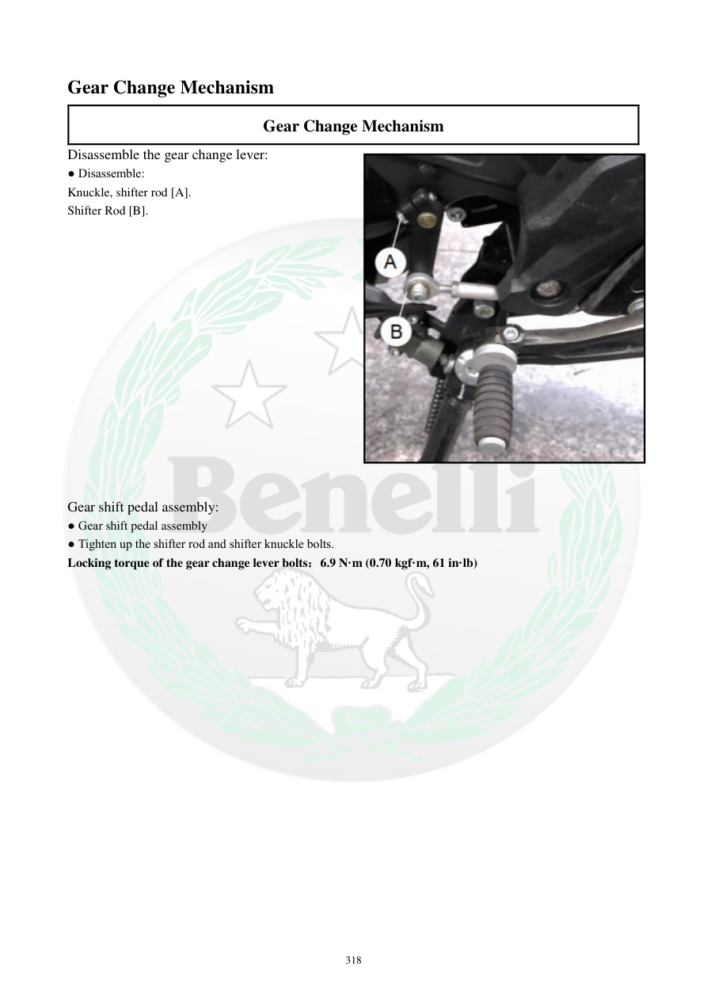

# Manual page 319

> Source: [page-0319.md](../source/page-0319.md)

## Page image / diagram

- [page-0319-img-01.jpeg](../images/embedded/page-0319-img-01.jpeg)

## Extracted text

# Source page 319

 
318 
Gear Change Mechanism 
Gear Change Mechanism 
Disassemble the gear change lever: 
● Disassemble: 
Knuckle, shifter rod [A]. 
Shifter Rod [B].  
  
 
 
 
 
 
 
 
 
 
 
 
 
 
 
Gear shift pedal assembly: 
● Gear shift pedal assembly 
● Tighten up the shifter rod and shifter knuckle bolts. 
Locking torque of the gear change lever bolts：6.9 N·m (0.70 kgf·m, 61 in·lb)

## Persian notes

### اهرم تعویض دنده
- برای باز کردن اهرم تعویض دنده، **Knuckle و Shifter Rod** جدا می‌شوند.
- پیچ‌های میله تعویض و مفصل تعویض دنده با گشتاور **6.9 N·m (61 in·lb)** سفت می‌شوند.
- هنگام مونتاژ، موقعیت و جهت اتصال قطعات مطابق تصویر صفحه رعایت شود.
