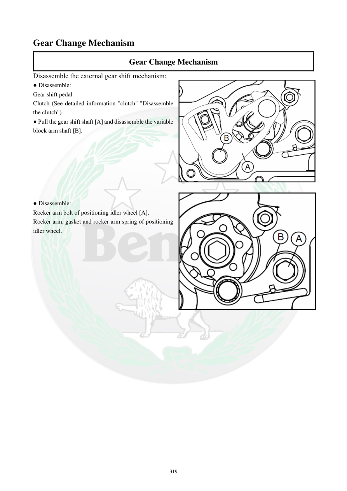

# Manual page 320

> Source: [page-0320.md](../source/page-0320.md)

## Page image / diagram

- [page-0320-img-01.png](../images/embedded/page-0320-img-01.png)

- [page-0320-img-02.png](../images/embedded/page-0320-img-02.png)

## Extracted text

# Source page 320

 
319 
Gear Change Mechanism 
Gear Change Mechanism 
Disassemble the external gear shift mechanism:  
● Disassemble: 
Gear shift pedal 
Clutch (See detailed information "clutch"-"Disassemble 
the clutch") 
● Pull the gear shift shaft [A] and disassemble the variable 
block arm shaft [B].  
 
  
 
 
 
 
 
● Disassemble: 
Rocker arm bolt of positioning idler wheel [A].  
Rocker arm, gasket and rocker arm spring of positioning 
idler wheel.

## Persian notes

<!-- Persian translation/explanation will be added here. -->
