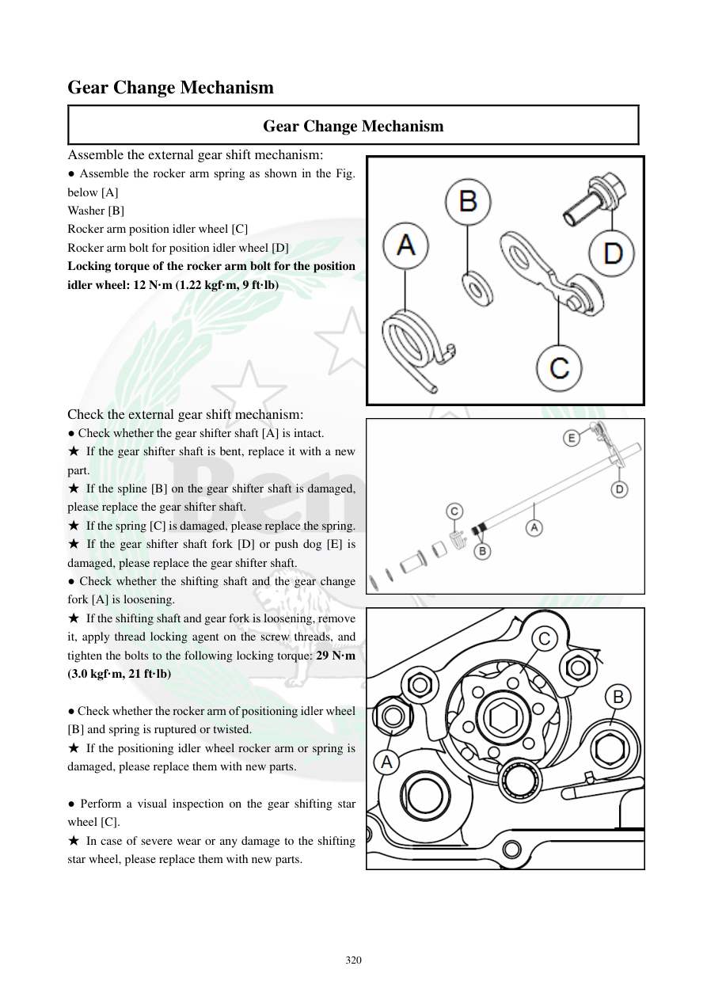

# Manual page 321

> Source: [page-0321.md](../source/page-0321.md)

## Page image / diagram

- [page-0321-img-01.png](../images/embedded/page-0321-img-01.png)

- [page-0321-img-02.png](../images/embedded/page-0321-img-02.png)

- [page-0321-img-03.png](../images/embedded/page-0321-img-03.png)

## Extracted text

# Source page 321

 
320 
Gear Change Mechanism 
Gear Change Mechanism 
Assemble the external gear shift mechanism: 
● Assemble the rocker arm spring as shown in the Fig. 
below [A] 
Washer [B] 
Rocker arm position idler wheel [C] 
Rocker arm bolt for position idler wheel [D]   
Locking torque of the rocker arm bolt for the position 
idler wheel: 12 N·m (1.22 kgf·m, 9 ft·lb) 
 
 
 
 
 
 
Check the external gear shift mechanism: 
● Check whether the gear shifter shaft [A] is intact.  
★ If the gear shifter shaft is bent, replace it with a new 
part.  
★ If the spline [B] on the gear shifter shaft is damaged, 
please replace the gear shifter shaft.  
★ If the spring [C] is damaged, please replace the spring.  
★ If the gear shifter shaft fork [D] or push dog [E] is 
damaged, please replace the gear shifter shaft.  
● Check whether the shifting shaft and the gear change 
fork [A] is loosening.  
★ If the shifting shaft and gear fork is loosening, remove 
it, apply thread locking agent on the screw threads, and 
tighten the bolts to the following locking torque: 29 N·m 
(3.0 kgf·m, 21 ft·lb) 
 
● Check whether the rocker arm of positioning idler wheel 
[B] and spring is ruptured or twisted.  
★ If the positioning idler wheel rocker arm or spring is 
damaged, please replace them with new parts.  
 
● Perform a visual inspection on the gear shifting star 
wheel [C]. 
★ In case of severe wear or any damage to the shifting 
star wheel, please replace them with new parts.

## Persian notes

<!-- Persian translation/explanation will be added here. -->
