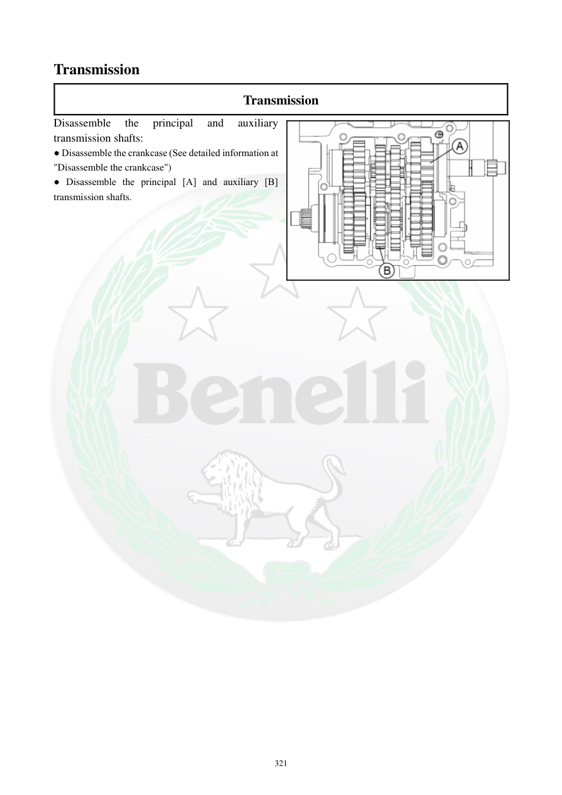

# Manual page 322

> Source: [page-0322.md](../source/page-0322.md)

## Page image / diagram

- [page-0322-img-01.png](../images/embedded/page-0322-img-01.png)

## Extracted text

# Source page 322

 
321 
Transmission 
Transmission 
Disassemble 
the 
principal 
and 
auxiliary 
transmission shafts: 
● Disassemble the crankcase (See detailed information at 
"Disassemble the crankcase") 
● Disassemble the principal [A] and auxiliary [B] 
transmission shafts.

## Persian notes

### باز کردن شفت‌های گیربکس
- پس از باز کردن کامل کرنک‌کیس، **شفت اصلی گیربکس (Principal)** و **شفت کمکی (Auxiliary)** خارج می‌شوند.
- برای بازکردن کامل، ترتیب قطعات و محل هر چرخ‌دنده/واشر را طبق صفحات بعدی حفظ کنید.
