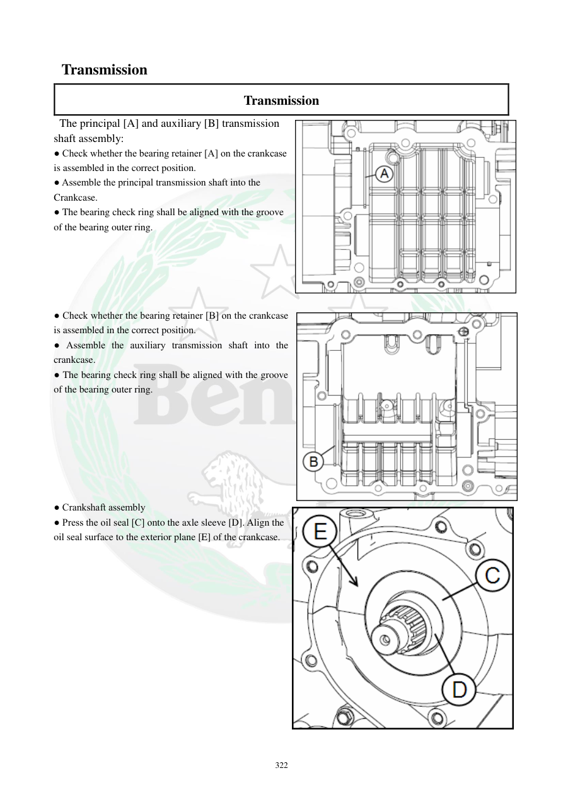

# Manual page 323

> Source: [page-0323.md](../source/page-0323.md)

## Page image / diagram

- [page-0323-img-01.png](../images/embedded/page-0323-img-01.png)

- [page-0323-img-02.png](../images/embedded/page-0323-img-02.png)

- [page-0323-img-03.png](../images/embedded/page-0323-img-03.png)

## Extracted text

# Source page 323

 
322 
 Transmission 
Transmission 
 The principal [A] and auxiliary [B] transmission  
shaft assembly: 
● Check whether the bearing retainer [A] on the crankcase  
is assembled in the correct position.  
● Assemble the principal transmission shaft into the  
Crankcase. 
● The bearing check ring shall be aligned with the groove  
of the bearing outer ring.  
 
 
 
 
 
● Check whether the bearing retainer [B] on the crankcase 
is assembled in the correct position.  
● Assemble the auxiliary transmission shaft into the 
crankcase. 
● The bearing check ring shall be aligned with the groove 
of the bearing outer ring.  
 
 
 
 
 
 
 
● Crankshaft assembly 
● Press the oil seal [C] onto the axle sleeve [D]. Align the 
oil seal surface to the exterior plane [E] of the crankcase.

## Persian notes

<!-- Persian translation/explanation will be added here. -->
