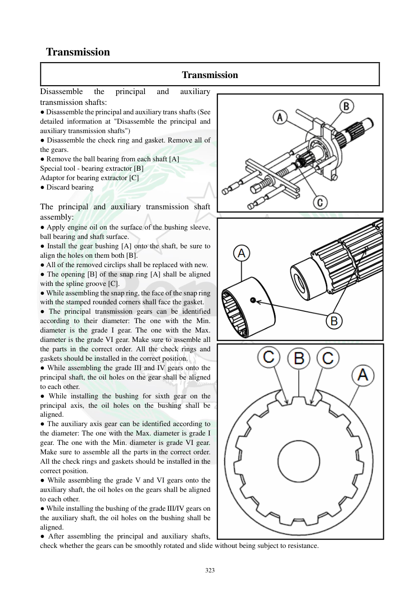

# Manual page 324

> Source: [page-0324.md](../source/page-0324.md)

## Page image / diagram

- [page-0324-img-01.png](../images/embedded/page-0324-img-01.png)

- [page-0324-img-02.png](../images/embedded/page-0324-img-02.png)

- [page-0324-img-03.png](../images/embedded/page-0324-img-03.png)

## Extracted text

# Source page 324

 
323 
 Transmission 
Transmission 
Disassemble 
the 
principal 
and 
auxiliary 
transmission shafts: 
● Disassemble the principal and auxiliary trans shafts (See 
detailed information at "Disassemble the principal and 
auxiliary transmission shafts") 
● Disassemble the check ring and gasket. Remove all of 
the gears.  
● Remove the ball bearing from each shaft [A] 
Special tool - bearing extractor [B] 
Adaptor for bearing extractor [C] 
● Discard bearing 
 
The principal and auxiliary transmission shaft 
assembly: 
● Apply engine oil on the surface of the bushing sleeve, 
ball bearing and shaft surface.  
● Install the gear bushing [A] onto the shaft, be sure to 
align the holes on them both [B].  
● All of the removed circlips shall be replaced with new.  
● The opening [B] of the snap ring [A] shall be aligned 
with the spline groove [C].  
● While assembling the snap ring, the face of the snap ring 
with the stamped rounded corners shall face the gasket.  
● The principal transmission gears can be identified 
according to their diameter: The one with the Min. 
diameter is the grade I gear. The one with the Max. 
diameter is the grade VI gear. Make sure to assemble all 
the parts in the correct order. All the check rings and 
gaskets should be installed in the correct position.  
● While assembling the grade III and IV gears onto the 
principal shaft, the oil holes on the gear shall be aligned 
to each other.  
● While installing the bushing for sixth gear on the 
principal axis, the oil holes on the bushing shall be 
aligned.  
● The auxiliary axis gear can be identified according to 
the diameter: The one with the Max. diameter is grade I 
gear. The one with the Min. diameter is grade VI gear. 
Make sure to assemble all the parts in the correct order. 
All the check rings and gaskets should be installed in the 
correct position.  
● While assembling the grade V and VI gears onto the 
auxiliary shaft, the oil holes on the gears shall be aligned 
to each other.  
● While installing the bushing of the grade III/IV gears on 
the auxiliary shaft, the oil holes on the bushing shall be 
aligned.  
● After assembling the principal and auxiliary shafts, 
check whether the gears can be smoothly rotated and slide without being subject to resistance.

## Persian notes

<!-- Persian translation/explanation will be added here. -->
