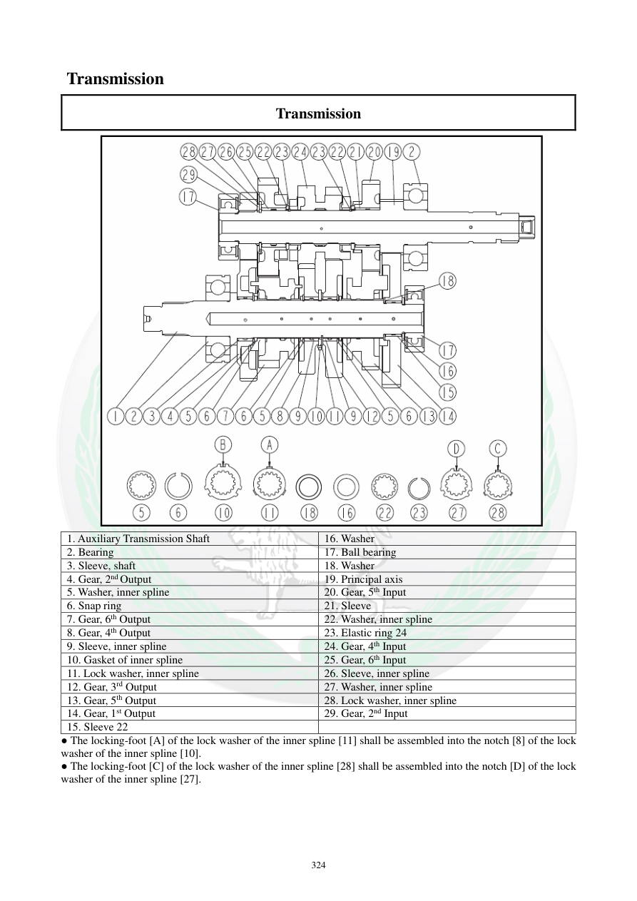

# Manual page 325

> Source: [page-0325.md](../source/page-0325.md)

## Page image / diagram

- [page-0325-img-01.png](../images/embedded/page-0325-img-01.png)

## Extracted text

# Source page 325

 
324 
Transmission 
Transmission 
 
1. Auxiliary Transmission Shaft 
16. Washer 
2. Bearing 
17. Ball bearing 
3. Sleeve, shaft 
18. Washer 
4. Gear, 2nd Output 
19. Principal axis 
5. Washer, inner spline 
20. Gear, 5th Input 
6. Snap ring 
21. Sleeve 
7. Gear, 6th Output 
22. Washer, inner spline 
8. Gear, 4th Output 
23. Elastic ring 24 
9. Sleeve, inner spline 
24. Gear, 4th Input   
10. Gasket of inner spline 
25. Gear, 6th Input 
11. Lock washer, inner spline 
26. Sleeve, inner spline 
12. Gear, 3rd Output 
27. Washer, inner spline 
13. Gear, 5th Output 
28. Lock washer, inner spline 
14. Gear, 1st Output 
29. Gear, 2nd Input 
15. Sleeve 22 
 
● The locking-foot [A] of the lock washer of the inner spline [11] shall be assembled into the notch [8] of the lock 
washer of the inner spline [10].  
● The locking-foot [C] of the lock washer of the inner spline [28] shall be assembled into the notch [D] of the lock 
washer of the inner spline [27].

## Persian notes

### ترتیب قطعات گیربکس
- این صفحه نمای انفجاری و شماره قطعات شفت‌های اصلی و کمکی را نشان می‌دهد و برای حفظ ترتیب مونتاژ مرجع تصویری اصلی است.
- دو **Lock Washer** مربوط به هزارخار داخلی باید زبانه قفل خود را در شیار متناظر واشر قرار دهند:
  - زبانه **[A]** در شیار **[8]**
  - زبانه **[C]** در شیار **[D]**
- هنگام بازکردن، قطعات را دقیقاً به ترتیب شکل بچینید تا ترتیب دنده‌ها و بوش‌ها جابه‌جا نشود.
