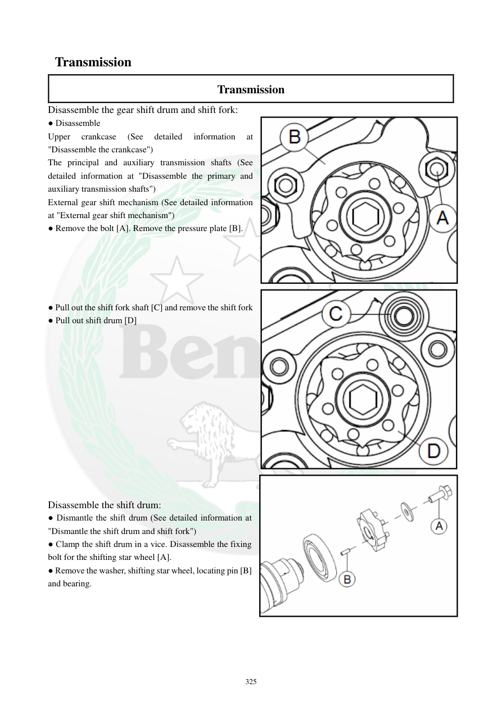

# Manual page 326

> Source: [page-0326.md](../source/page-0326.md)

## Page image / diagram

- [page-0326-img-01.png](../images/embedded/page-0326-img-01.png)

- [page-0326-img-02.png](../images/embedded/page-0326-img-02.png)

- [page-0326-img-03.png](../images/embedded/page-0326-img-03.png)

## Extracted text

# Source page 326

 
325 
 Transmission 
Transmission 
Disassemble the gear shift drum and shift fork:  
● Disassemble 
Upper 
crankcase 
(See 
detailed 
information 
at 
"Disassemble the crankcase") 
The principal and auxiliary transmission shafts (See 
detailed information at "Disassemble the primary and 
auxiliary transmission shafts") 
External gear shift mechanism (See detailed information 
at "External gear shift mechanism")  
● Remove the bolt [A]. Remove the pressure plate [B]. 
 
 
 
 
 
● Pull out the shift fork shaft [C] and remove the shift fork 
● Pull out shift drum [D] 
 
 
 
 
 
 
 
 
 
 
 
 
 
Disassemble the shift drum: 
● Dismantle the shift drum (See detailed information at 
"Dismantle the shift drum and shift fork") 
● Clamp the shift drum in a vice. Disassemble the fixing 
bolt for the shifting star wheel [A].  
● Remove the washer, shifting star wheel, locating pin [B] 
and bearing.

## Persian notes

### باز کردن شیفت‌درام و دوشاخه‌های تعویض دنده
- ابتدا کرنک‌کیس، شفت‌های اصلی و کمکی گیربکس و مکانیزم بیرونی تعویض دنده باز شوند.
- پیچ **[A]** و صفحه نگهدارنده فشار **[B]** خارج شوند.
- محور دوشاخه تعویض دنده بیرون کشیده و دوشاخه‌ها جدا شوند.
- سپس **Shift Drum** خارج شود.
- برای باز کردن ستاره تعویض دنده، درام داخل گیره نگه داشته شده و پیچ ستاره باز شود؛ سپس واشر، ستاره، پین موقعیت‌دهنده و بلبرینگ جدا شوند.
