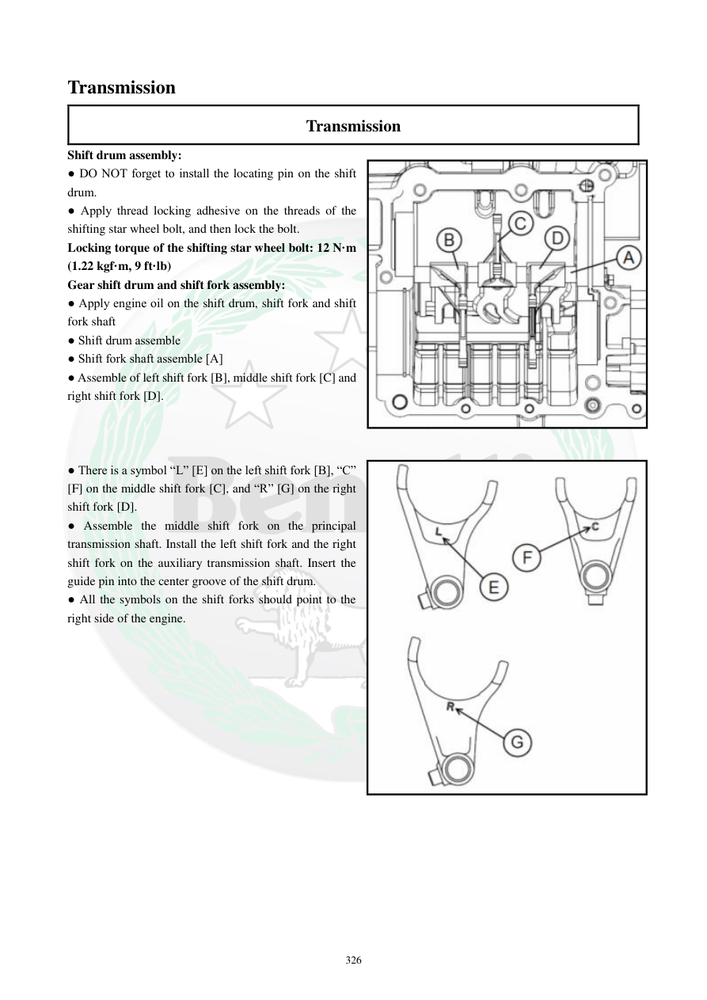

# Manual page 327

> Source: [page-0327.md](../source/page-0327.md)

## Page image / diagram

- [page-0327-img-01.jpeg](../images/embedded/page-0327-img-01.jpeg)

- [page-0327-img-02.jpeg](../images/embedded/page-0327-img-02.jpeg)

## Extracted text

# Source page 327

 
326 
Transmission 
Transmission 
Shift drum assembly: 
● DO NOT forget to install the locating pin on the shift 
drum.  
● Apply thread locking adhesive on the threads of the 
shifting star wheel bolt, and then lock the bolt.  
Locking torque of the shifting star wheel bolt: 12 N·m 
(1.22 kgf·m, 9 ft·lb) 
Gear shift drum and shift fork assembly: 
● Apply engine oil on the shift drum, shift fork and shift 
fork shaft 
● Shift drum assemble 
● Shift fork shaft assemble [A] 
● Assemble of left shift fork [B], middle shift fork [C] and 
right shift fork [D].  
 
 
 
● There is a symbol “L” [E] on the left shift fork [B], “C” 
[F] on the middle shift fork [C], and “R” [G] on the right 
shift fork [D].    
● Assemble the middle shift fork on the principal 
transmission shaft. Install the left shift fork and the right 
shift fork on the auxiliary transmission shaft. Insert the 
guide pin into the center groove of the shift drum.  
● All the symbols on the shift forks should point to the 
right side of the engine.

## Persian notes

<!-- Persian translation/explanation will be added here. -->
