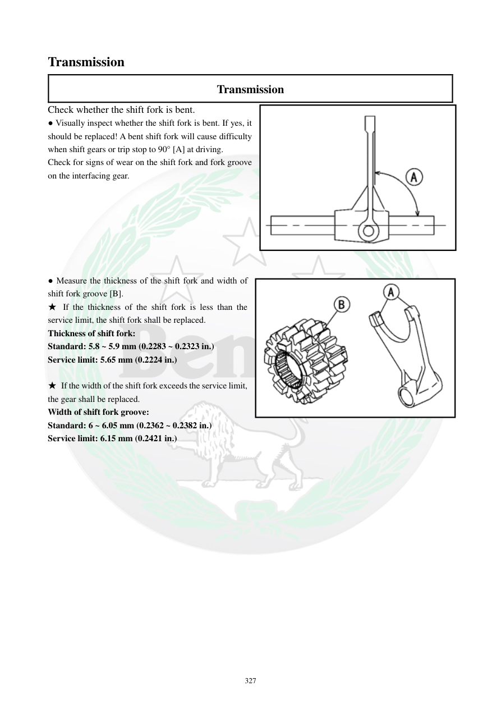

# Manual page 328

> Source: [page-0328.md](../source/page-0328.md)

## Page image / diagram

- [page-0328-img-01.png](../images/embedded/page-0328-img-01.png)

- [page-0328-img-02.png](../images/embedded/page-0328-img-02.png)

## Extracted text

# Source page 328

 
327 
Transmission 
Transmission 
Check whether the shift fork is bent.  
● Visually inspect whether the shift fork is bent. If yes, it 
should be replaced! A bent shift fork will cause difficulty 
when shift gears or trip stop to 90° [A] at driving.  
Check for signs of wear on the shift fork and fork groove 
on the interfacing gear.   
 
 
 
 
 
 
 
● Measure the thickness of the shift fork and width of 
shift fork groove [B].  
★ If the thickness of the shift fork is less than the 
service limit, the shift fork shall be replaced.  
Thickness of shift fork:  
Standard: 5.8 ~ 5.9 mm (0.2283 ~ 0.2323 in.) 
Service limit: 5.65 mm (0.2224 in.) 
 
★ If the width of the shift fork exceeds the service limit, 
the gear shall be replaced.  
Width of shift fork groove: 
Standard: 6 ~ 6.05 mm (0.2362 ~ 0.2382 in.) 
Service limit: 6.15 mm (0.2421 in.)

## Persian notes

<!-- Persian translation/explanation will be added here. -->
