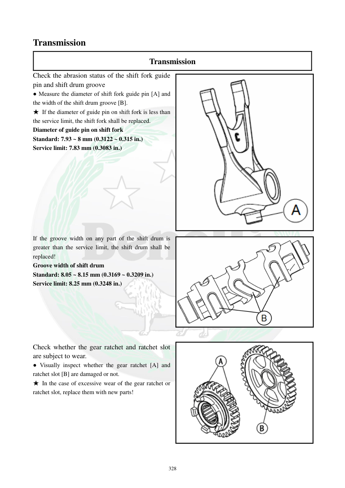

# Manual page 329

> Source: [page-0329.md](../source/page-0329.md)

## Page image / diagram

- [page-0329-img-01.png](../images/embedded/page-0329-img-01.png)

- [page-0329-img-02.png](../images/embedded/page-0329-img-02.png)

- [page-0329-img-03.png](../images/embedded/page-0329-img-03.png)

## Extracted text

# Source page 329

 
328 
Transmission 
Transmission 
Check the abrasion status of the shift fork guide 
pin and shift drum groove 
● Measure the diameter of shift fork guide pin [A] and 
the width of the shift drum groove [B]. 
★ If the diameter of guide pin on shift fork is less than 
the service limit, the shift fork shall be replaced.  
Diameter of guide pin on shift fork  
Standard: 7.93 ~ 8 mm (0.3122 ~ 0.315 in.) 
Service limit: 7.83 mm (0.3083 in.) 
 
 
 
 
 
 
 
 
 
If the groove width on any part of the shift drum is 
greater than the service limit, the shift drum shall be 
replaced!  
Groove width of shift drum  
Standard: 8.05 ~ 8.15 mm (0.3169 ~ 0.3209 in.) 
Service limit: 8.25 mm (0.3248 in.) 
 
 
 
 
 
 
Check whether the gear ratchet and ratchet slot 
are subject to wear.  
● Visually inspect whether the gear ratchet [A] and 
ratchet slot [B] are damaged or not. 
★ In the case of excessive wear of the gear ratchet or 
ratchet slot, replace them with new parts!

## Persian notes

### بازرسی پین راهنما و شیار شیفت‌درام
- قطر پین راهنمای دوشاخه اندازه‌گیری شود:
  - استاندارد **7.93 تا 8.00 mm**
  - حد سرویس **7.83 mm**
- اگر قطر پین کمتر از حد سرویس باشد، دوشاخه تعویض شود.
- عرض شیار شیفت‌درام:
  - استاندارد **8.05 تا 8.15 mm**
  - حد سرویس **8.25 mm**
- اگر عرض شیار در هر نقطه از حد سرویس بیشتر باشد، شیفت‌درام تعویض شود.
- چرخ ستاره‌ای/راتچت دنده و شیارهای درگیرکننده آن نیز از نظر آسیب و سایش شدید بررسی و در صورت خرابی تعویض شوند.
