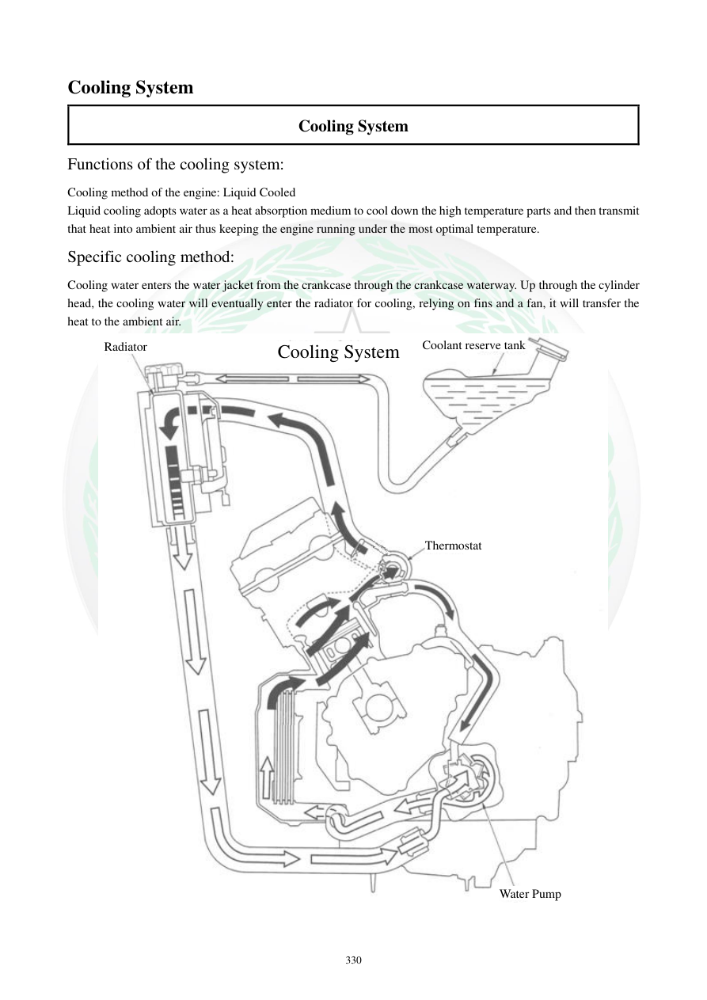

# Manual page 331

> Source: [page-0331.md](../source/page-0331.md)

## Page image / diagram

- [page-0331-img-01.jpeg](../images/embedded/page-0331-img-01.jpeg)

## Extracted text

# Source page 331

 
330 
Cooling System 
Cooling System 
Functions of the cooling system: 
Cooling method of the engine: Liquid Cooled 
Liquid cooling adopts water as a heat absorption medium to cool down the high temperature parts and then transmit 
that heat into ambient air thus keeping the engine running under the most optimal temperature.   
Specific cooling method: 
Cooling water enters the water jacket from the crankcase through the crankcase waterway. Up through the cylinder 
head, the cooling water will eventually enter the radiator for cooling, relying on fins and a fan, it will transfer the 
heat to the ambient air.   
 
Radiator 
Coolant reserve tank
Thermostat
Water Pump
Cooling System

## Persian notes

<!-- Persian translation/explanation will be added here. -->
