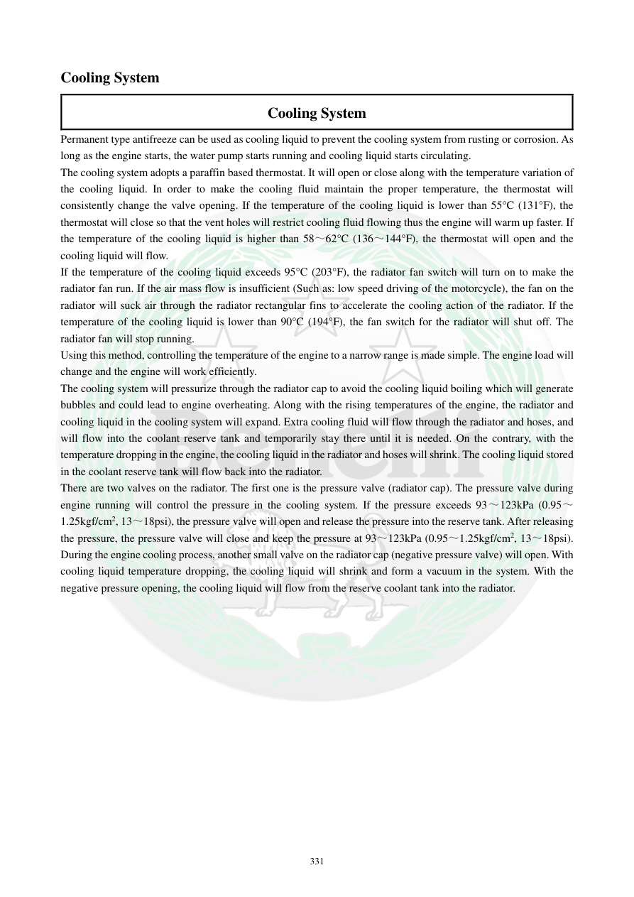

# Manual page 332

> Source: [page-0332.md](../source/page-0332.md)

## Page image / diagram

## Extracted text

# Source page 332

 
331 
Cooling System 
Cooling System 
Permanent type antifreeze can be used as cooling liquid to prevent the cooling system from rusting or corrosion. As 
long as the engine starts, the water pump starts running and cooling liquid starts circulating.  
The cooling system adopts a paraffin based thermostat. It will open or close along with the temperature variation of 
the cooling liquid. In order to make the cooling fluid maintain the proper temperature, the thermostat will 
consistently change the valve opening. If the temperature of the cooling liquid is lower than 55°C (131°F), the 
thermostat will close so that the vent holes will restrict cooling fluid flowing thus the engine will warm up faster. If 
the temperature of the cooling liquid is higher than 58～62°C (136～144°F), the thermostat will open and the 
cooling liquid will flow.  
If the temperature of the cooling liquid exceeds 95°C (203°F), the radiator fan switch will turn on to make the 
radiator fan run. If the air mass flow is insufficient (Such as: low speed driving of the motorcycle), the fan on the 
radiator will suck air through the radiator rectangular fins to accelerate the cooling action of the radiator. If the 
temperature of the cooling liquid is lower than 90°C (194°F), the fan switch for the radiator will shut off. The 
radiator fan will stop running.  
Using this method, controlling the temperature of the engine to a narrow range is made simple. The engine load will 
change and the engine will work efficiently.  
The cooling system will pressurize through the radiator cap to avoid the cooling liquid boiling which will generate 
bubbles and could lead to engine overheating. Along with the rising temperatures of the engine, the radiator and 
cooling liquid in the cooling system will expand. Extra cooling fluid will flow through the radiator and hoses, and 
will flow into the coolant reserve tank and temporarily stay there until it is needed. On the contrary, with the 
temperature dropping in the engine, the cooling liquid in the radiator and hoses will shrink. The cooling liquid stored 
in the coolant reserve tank will flow back into the radiator.   
There are two valves on the radiator. The first one is the pressure valve (radiator cap). The pressure valve during 
engine running will control the pressure in the cooling system. If the pressure exceeds 93～123kPa (0.95～
1.25kgf/cm2, 13～18psi), the pressure valve will open and release the pressure into the reserve tank. After releasing 
the pressure, the pressure valve will close and keep the pressure at 93～123kPa (0.95～1.25kgf/cm2, 13～18psi). 
During the engine cooling process, another small valve on the radiator cap (negative pressure valve) will open. With 
cooling liquid temperature dropping, the cooling liquid will shrink and form a vacuum in the system. With the 
negative pressure opening, the cooling liquid will flow from the reserve coolant tank into the radiator.

## Persian notes

### منطق عملکرد ترموستات، فن و درپوش رادیاتور
- واترپمپ با روشن شدن موتور شروع به گردش مایع می‌کند.
- ترموستات پارافینی:
  - زیر **55°C** بسته می‌ماند تا موتور سریع‌تر گرم شود.
  - در **58 تا 62°C** باز می‌شود و گردش مایع به سمت رادیاتور انجام می‌شود.
- فن رادیاتور در دمای بالاتر از **95°C** روشن و در دمای کمتر از **90°C** خاموش می‌شود.
- سیستم با درپوش رادیاتور تحت فشار کار می‌کند. فشار **93 تا 123 kPa (0.95 تا 1.25 kgf/cm²، 13 تا 18 psi)** محدوده عملکرد ذکرشده در دفترچه است.
- با افزایش دما و انبساط مایع، مایع اضافی به مخزن ذخیره می‌رود؛ هنگام سرد شدن، با ایجاد خلأ و عملکرد شیر منفی فشار، مایع از مخزن به رادیاتور برمی‌گردد.
- برای جلوگیری از خطا در عیب‌یابی، دمای بازشدن ترموستات و دمای عملکرد فن را جدا از هم در نظر بگیرید.
