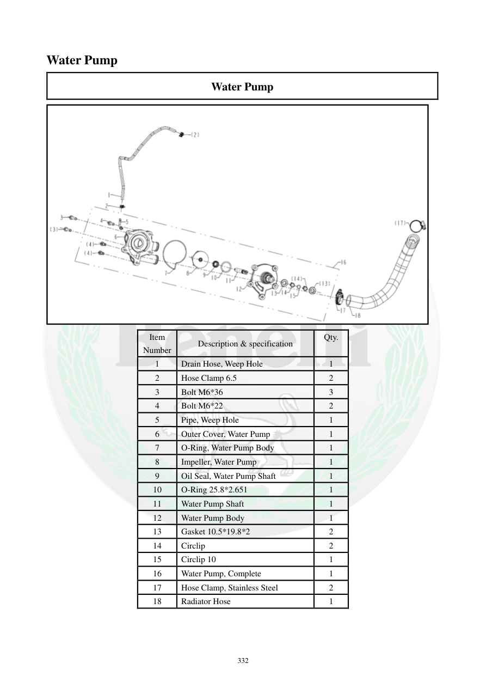

# Manual page 333

> Source: [page-0333.md](../source/page-0333.md)

## Page image / diagram

- [page-0333-img-02.png](../images/embedded/page-0333-img-02.png)

## Extracted text

# Source page 333

 
332 
Water Pump 
Water Pump 
 
Item 
Number 
Description & specification 
Qty. 
 
1 
Drain Hose, Weep Hole 
1 
2 
Hose Clamp 6.5 
2 
3 
Bolt M6*36 
3 
4 
Bolt M6*22 
2 
5 
Pipe, Weep Hole 
1 
6 
Outer Cover, Water Pump 
1 
7 
O-Ring, Water Pump Body 
1 
8 
Impeller, Water Pump 
1 
9 
Oil Seal, Water Pump Shaft 
1 
10 
O-Ring 25.8*2.651 
1 
11 
Water Pump Shaft 
1 
12 
Water Pump Body 
1 
13 
Gasket 10.5*19.8*2   
2 
14 
Circlip 
2 
15 
Circlip 10 
1 
16 
Water Pump, Complete 
1 
17 
Hose Clamp, Stainless Steel 
2 
18 
Radiator Hose 
1

## Persian notes

### اجزای واترپمپ
اجزای اصلی طبق نمای انفجاری صفحه:
- شلنگ و لوله سوراخ تخلیه/Weep Hole
- بست‌های شلنگ
- پیچ‌های **M6×36** و **M6×22**
- کاور بیرونی واترپمپ
- اورینگ بدنه واترپمپ
- پروانه
- **Oil Seal** محور واترپمپ
- اورینگ **25.8×2.651**
- محور واترپمپ
- بدنه واترپمپ
- واشرهای **10.5×19.8×2**
- Circlip و Circlip 10
- مجموعه کامل واترپمپ
- شلنگ رادیاتور و بست استیل
این صفحه برای شناسایی قطعات و تطبیق هنگام باز و بست مرجع تصویری اصلی است.
