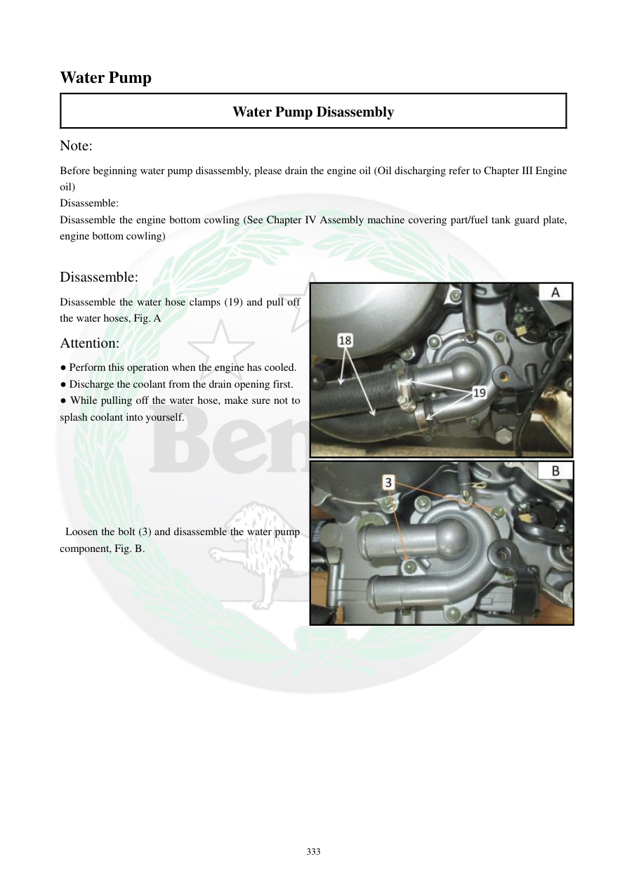

# Manual page 334

> Source: [page-0334.md](../source/page-0334.md)

## Page image / diagram

- [page-0334-img-01.jpeg](../images/embedded/page-0334-img-01.jpeg)

- [page-0334-img-02.jpeg](../images/embedded/page-0334-img-02.jpeg)

## Extracted text

# Source page 334

 
333 
Water Pump 
Water Pump Disassembly 
Note: 
Before beginning water pump disassembly, please drain the engine oil (Oil discharging refer to Chapter III Engine 
oil) 
Disassemble: 
Disassemble the engine bottom cowling (See Chapter IV Assembly machine covering part/fuel tank guard plate, 
engine bottom cowling)   
 
Disassemble: 
Disassemble the water hose clamps (19) and pull off 
the water hoses, Fig. A 
Attention: 
● Perform this operation when the engine has cooled.  
● Discharge the coolant from the drain opening first.  
● While pulling off the water hose, make sure not to 
splash coolant into yourself.  
 
 
 
 
 
 
 Loosen the bolt (3) and disassemble the water pump 
component, Fig. B.

## Persian notes

### باز کردن واترپمپ
- قبل از شروع، **روغن موتور تخلیه شود**.
- قاب زیر موتور و سپس بست‌های شلنگ‌های آب باز شوند.
- این کار فقط وقتی انجام شود که **موتور کاملاً خنک شده باشد**.
- ابتدا مایع خنک‌کننده از سوراخ تخلیه خارج شود.
- هنگام جدا کردن شلنگ‌ها مراقب پاشش مایع خنک‌کننده باشید.
- سپس پیچ‌های واترپمپ باز و مجموعه واترپمپ جدا شود.
- ترتیب بازکردن و محل شلنگ‌ها را مطابق تصویر صفحه حفظ کنید.
