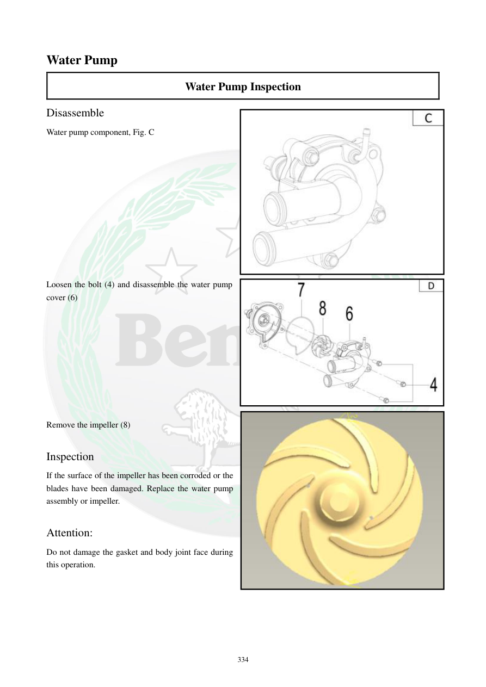

# Manual page 335

> Source: [page-0335.md](../source/page-0335.md)

## Page image / diagram

- [page-0335-img-01.jpeg](../images/embedded/page-0335-img-01.jpeg)

- [page-0335-img-02.jpeg](../images/embedded/page-0335-img-02.jpeg)

- [page-0335-img-03.jpeg](../images/embedded/page-0335-img-03.jpeg)

## Extracted text

# Source page 335

 
334 
Water Pump 
Water Pump Inspection 
Disassemble 
Water pump component, Fig. C 
 
 
 
 
 
 
 
 
 
 
 
Loosen the bolt (4) and disassemble the water pump 
cover (6) 
 
 
 
 
 
 
 
 
 
Remove the impeller (8) 
 
Inspection  
If the surface of the impeller has been corroded or the 
blades have been damaged. Replace the water pump 
assembly or impeller.  
 
Attention: 
Do not damage the gasket and body joint face during 
this operation.

## Persian notes

### بازرسی واترپمپ و پروانه
- مجموعه واترپمپ باز و پیچ‌های کاور آن خارج شود.
- پروانه جدا شود.
- سطح پروانه از نظر **خوردگی** و پره‌ها از نظر **آسیب یا شکستگی** بررسی شوند.
- در صورت خوردگی یا آسیب، طبق دفترچه مجموعه واترپمپ یا پروانه تعویض شود.
- هنگام بازکردن مراقب باشید سطح تماس **واشر و بدنه** آسیب نبیند.
