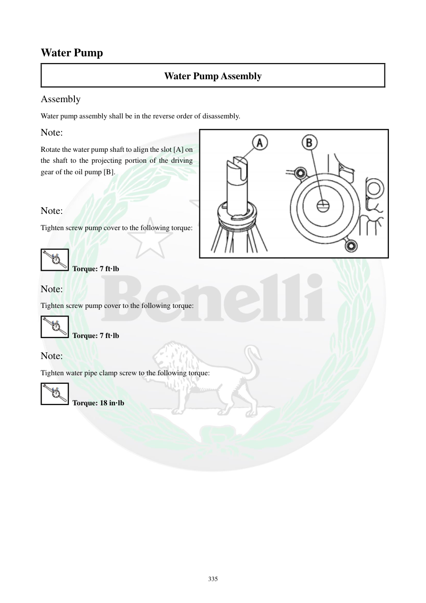

# Manual page 336

> Source: [page-0336.md](../source/page-0336.md)

## Page image / diagram

- [page-0336-img-02.png](../images/embedded/page-0336-img-02.png)

## Extracted text

# Source page 336

 
335 
Water Pump 
Water Pump Assembly 
Assembly 
Water pump assembly shall be in the reverse order of disassembly.  
Note: 
Rotate the water pump shaft to align the slot [A] on 
the shaft to the projecting portion of the driving 
gear of the oil pump [B].  
 
 
Note: 
Tighten screw pump cover to the following torque: 
 
 Torque: 7 ft·lb 
Note: 
Tighten screw pump cover to the following torque: 
 Torque: 7 ft·lb 
Note: 
Tighten water pipe clamp screw to the following torque: 
 Torque: 18 in·lb

## Persian notes

### مونتاژ واترپمپ
- مونتاژ در ترتیب معکوس بازکردن انجام شود.
- هنگام نصب، شیار روی محور واترپمپ باید با قسمت برجسته چرخ‌دنده محرک **پمپ روغن** هم‌راستا شود.
- گشتاور پیچ‌های کاور واترپمپ: **7 ft·lb**.
- گشتاور پیچ بست لوله آب: **18 in·lb**.
- متن انگلیسی گشتاور کاور را دو بار تکرار کرده، اما مقدار هر دو بار یکسان است.
- قبل از راه‌اندازی، اتصال شلنگ‌ها، بست‌ها و آب‌بندی‌ها بررسی شوند.
