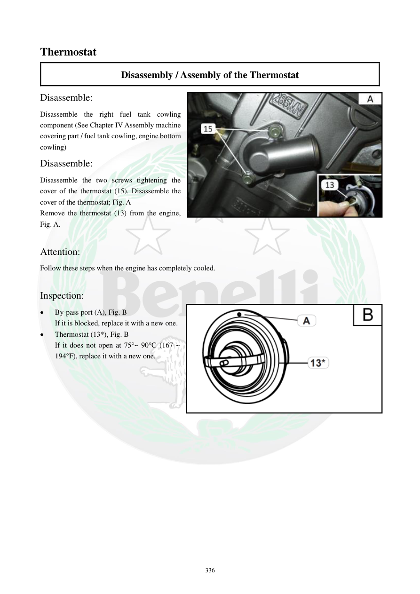

# Manual page 337

> Source: [page-0337.md](../source/page-0337.md)

## Page image / diagram

- [page-0337-img-01.png](../images/embedded/page-0337-img-01.png)

- [page-0337-img-02.jpeg](../images/embedded/page-0337-img-02.jpeg)

## Extracted text

# Source page 337

 
336 
Thermostat 
Disassembly / Assembly of the Thermostat 
Disassemble: 
Disassemble the right fuel tank cowling 
component (See Chapter IV Assembly machine 
covering part / fuel tank cowling, engine bottom 
cowling) 
Disassemble: 
Disassemble the two screws tightening the 
cover of the thermostat (15). Disassemble the 
cover of the thermostat; Fig. A  
Remove the thermostat (13) from the engine, 
Fig. A. 
 
Attention: 
Follow these steps when the engine has completely cooled.  
 
Inspection: 
 
By-pass port (A), Fig. B 
If it is blocked, replace it with a new one.  
 
Thermostat (13*), Fig. B 
If it does not open at 75°~ 90°C (167 ~ 
194°F), replace it with a new one.

## Persian notes

### باز کردن و تست ترموستات
- این کار باید فقط با **موتور کاملاً سرد** انجام شود.
- قاب سمت راست باک باز و سپس دو پیچ کاور ترموستات باز شوند.
- ترموستات از موتور خارج شود.
- **By-pass port** از نظر گرفتگی بررسی شود؛ در صورت گرفتگی طبق دفترچه تعویض شود.
- ترموستات باید در محدوده **75 تا 90°C** باز شود؛ اگر در این محدوده باز نشود، تعویض شود.
- دقت کنید عدد عملکرد ترموستات در این صفحه با توضیح عملکرد سیستم در صفحه 332 یکی نیست: صفحه 332 شروع بازشدن را **58 تا 62°C** ذکر می‌کند، در حالی که صفحه 337 معیار تست **75 تا 90°C** را آورده است. این اختلاف باید به‌عنوان **اختلاف متن دفترچه** حفظ شود و بدون بررسی تصویر/منبع تکمیلی یکی از اعداد به‌عنوان عدد قطعی انتخاب نشود.
